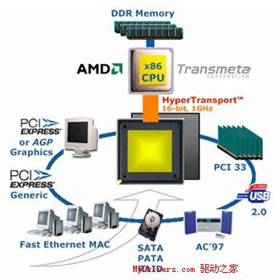
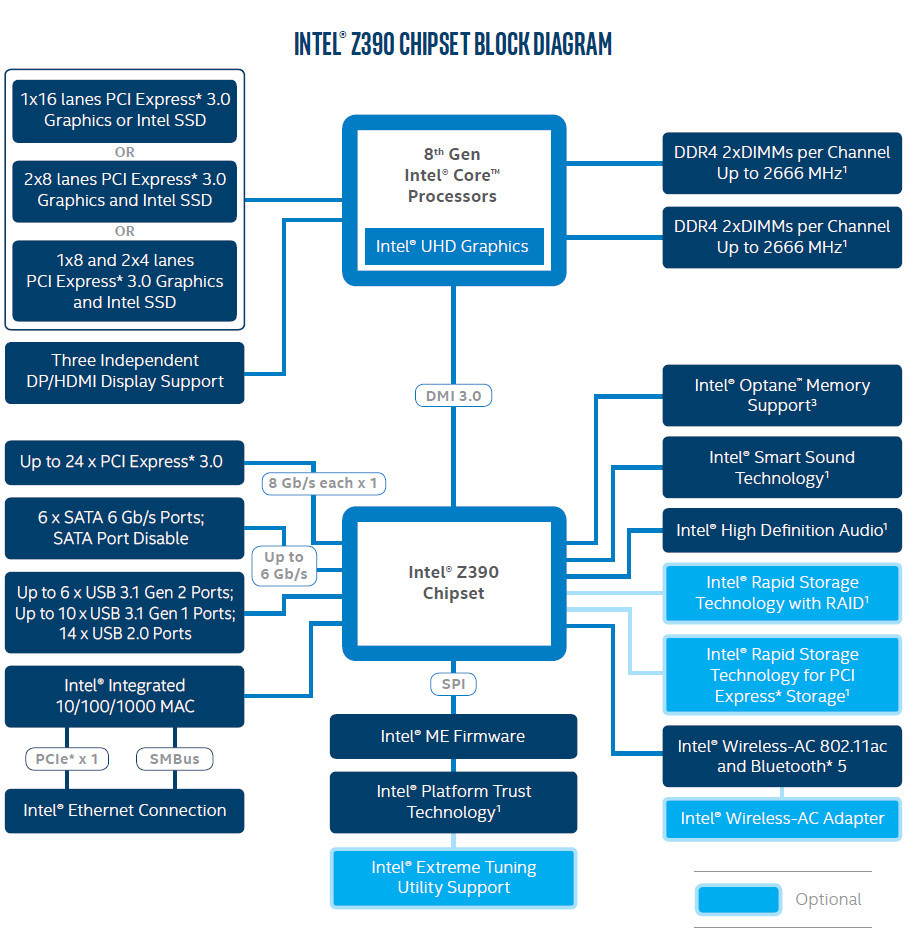

# Unidad 4. PROCESADORES

1\. Definición

2\. Diagrama de bloques

3\. Características

4\. Disipación de calor CPU

5\. Generaciones recientes de Intel

6\. Generaciones recientes de AMD

7\. Procesador Apple M1

8\. Gráficas en procesadores

9\. Identificar CPU por línea de comandos

# 1. Definición de procesador

Es el componente principal del ordenador\, dirige y controla el resto de componentes\, decodifica y ejecuta las instrucciones de los programas cargados en la RAM\. Es un circuito integrado o chip\, formado por millones de _[ transistores](https://en.wikipedia.org/wiki/Transistor)_ \.

No solo se encuentra en ordenadores\, también se encuentra en teléfonos móviles\, electrodomésticos\, consolas\, etc\.

# 2. Diagrama de bloques CPU

En las CPU actuales pueden ser de varios núcleos y  se añaden\, con respecto a la arquitectura Von Neumann\, los siguientes elementos:

* **Unidad de coma flotante\, FPU**  \(Floating Point Unit\)\. Se le conoce como coprocesador matemático\. Realiza las operaciones en  _[coma flotante](https://es.wikipedia.org/wiki/Coma_flotante)_  \(también lo podemos encontrar como  **punto flotante** \)
* **La caché del procesador**  \(L1\, L2 y L3\)

# 3. Características de la CPU

## 3.1 Núcleos

Los procesadores antiguos eran  **single core** \, en los microprocesadores modernos suelen existir más de un núcleo \( **core** \) de procesamiento\. Cada núcleo es un pequeño microprocesador independiente dentro del mismo microprocesador\.

Cada núcleo se compone de su propia Unidad de Control \(UC\)\, Unidad Aritmético\-lógica \(UAL\)\, Unidad de Punto Flotante \(UPF\)\, Registros y los primeros niveles de Memoria Caché \(L1 y L2\)\.

Gracias a los núcleos\, el microprocesador será capaz de realizar a la vez una tarea \(ciclo de instrucción\) por cada núcleo que posea\. De esta manera el sistema responderá de manera más cómoda aunque una tarea monopolice uno de los núcleos\. Como regla general\, a mayor número de núcleos\, los microprocesadores presentan mejores prestaciones\.

¿Núcleo físico VS núcleo lógico? →

_[Simultaneous Multi Threading \(SMT\) de AMD vs  Hyper Threading de Intel](https://hardzone.es/reportajes/comparativas/intel-hyperthreading-amd-smt/)_

_[https://hardzone\.es/2018/08/11/importante\-no\-confundir\-hilos\-nucleos/](https://hardzone.es/2018/08/11/importante-no-confundir-hilos-nucleos/)_

_No confundir varios cores con sistemas multiprocesador_

No confundir varios cores con sistemas multiprocesador

## 3.2 Velocidad de reloj

También llamada frecuencia de funcionamiento\, se refiere al número de operaciones que la CPU puede realizar en un solo segundo\.

Viene dada por la velocidad del reloj y se mide en megahercios o gigahercios \(1 GHz = 1000 MHz\)\.

Por ejemplo una CPU con una velocidad de reloj de 3\,2 GHz ejecuta 3\.200 millones de ciclos por segundo.

¿Es más rápido en ejecutar una instrucción un procesador de 10GHz que uno de 5 GHz?

## 3.3 Transistores.

Los procesadores actuales están compuestos por millones de transistores.

### Número de transistores

**Ley de [Moore](https://es.wikipedia.org/wiki/Gordon_Moore)(1965)**. El número de transistores por unidad de superficie en circuitos integrado se duplicará cada año

Falta video 

### Litografía

El proceso de fabricación o  **litografía**  se mide en  **nanómetros**  \(para poneros en perspectiva de lo pequeño que es esto\, un nanómetro son 10^-7 centímetros, o lo que es lo mismo\, 0,0000001 centímetros), y es precisamente  **el tamaño de los transistores** \. Así pues\, un proceso de 14 nm significa que cada transistor mide 14 x 10^-7 centímetros.

Esto significa que en comparación, en el proceso de 7 nm se puede meter literalmente el doble de transistores que con el proceso de 14 nm en la misma unidad de superficie\. EL efecto de poder meter un mayor número de transistores en el mismo espacio repercute en el rendimiento y en la eficiencia energética, así que tener una litografía menor implica que el procesador será  **más potente y más eficiente** \.

Falta video 

Falta video 

# 3.4 Buses del sistema. Front Side Bus

**FSB \(Front Side Bus\)**

Es el bus que usaron los micros Intel desde finales de los años 90 hasta la arquitectura Core\. ** **

Se encarga de comunicar el procesador con el North Bridge\.

Se trata de un bus paralelo\, bidireccional\, compartido\.

La velocidad del FSB se mide en MHz\.

# 3.4 Buses del sistema. HyperTransport

**Tecnología HT** : \(“HyperTransport”\)\.

Tecnología desarrollada por AMD® en 2001 en sustitución del FSB clásico\.

Comunica procesador y chipset sin necesidad del uso del NorthBridge ó conexión entre procesadores en sistemas multiprocesador

Controlador de memoria integrado \(IMC\)

La velocidad se mide en GigaTransferences/second \(GT/s\)

# 3.4 Buses del sistema. QuickPath Interconnect

**Tecnología QuickPath Interconnect \(QPI\)\. 2008**

Respuesta de Intel a AMD frente a HyperTransport\.

Controlador de memoria integrado en la CPU \(IMC\)

Dos buses separados entre la CPU y el chipset lo que permite leer y escribir datos al mismo tiempo

La velocidad se mide en GigaTransferences/second \(GT/s\)

# 3.4 Buses del sistema. FSB vs QPI

# 3.4 Buses del sistema. DMI - Direct Media Interface

DMI v1

Aparece en 2004

Originariamente para conectar en northbridge con el southbridge\.

1GB/s

2 GT/s

**DMI v2**

2011

Conecta procesador con PCH

2 GB/s with a ×4 link

**DMI v3**

2015

Conecta procesador con PCH

3\.96 GB/s with a ×4 link

**DMI v4**

2021

Intel Gen 12th

3\.96 GB/s with a ×8 link

# 3.4 Buses del sistema.

**SPI \- Serial Peripheral Interface\.**

El bus SPI o bus de interfaz de periféricos serie\, es un estándar utilizado para transferir información entre dispositivos electrónicos en modo full\-duplex

# 3.5 Thermal Design Power. TDP

La Potencia de Diseño Térmico \(TDP\) representa la potencia media\, en vatios\, que el procesador disipa cuando funciona a Frecuencia Base con todos los núcleos activos bajo una carga de trabajo de alta complejidad\.

Un procesador con un TDP de 95W\, se espera que genere un valor de 95W de calor cuando está en 100% de su uso\.

El TDP no es una medida directa de cuánta potencia consumirá un componente\, pero si que es una buena aproximación\.

# 3.6 Memoria caché

* Memoria intermedia entre la memoria principal \(RAM\) y el procesador de baja capacidad y gran velocidad\.
* La memoria caché es usada por el procesador para reducir el tiempo promedio necesario para acceder a los datos de la memoria principal\, es decir es un tipo de memoria a la que el procesador tiene acceso directo\, casi instantáneo\, y en la que se almacenan los datos e instrucciones que más utiliza para «tenerlos a mano» de manera inmediata\.
* Niveles de memoria caché:
  * Nivel 1 \(L1\): Esta memoria caché es extremadamente rápida pero relativamente pequeña y hoy día se encuentra integrada en el CPU \(años atrás podía o no estar integrada en el CPU\)\. Todas las instrucciones se buscan primero aquí\, si no están presentes entonces se procede al siguiente nivel\.
  * Nivel 2 \(L2\)\. más grande que L1 y también está dentro del CPU \(años atrás no lo estaba\)\. Si las instrucciones no fueron encontradas en el Nivel L1 entonces se buscan en L2\, más lenta que L1\.
  * Nivel 3 \(L3\): Es un nivel de memoria especializada que ayuda a mejorar el rendimiento de los niveles de caché L1 y L2\. Es mucho más lenta que la memoria L1 o L2\, pero mucho más rápida que la memoria RAM\.
* En el caso de los procesadores con varios cores\, cada uno de ellos tiene su propio caché L1 y  L2\, pero\, todos comparten el mismo caché L3\.

# Actividad - 2. Die Shot - Die Map

# Die Shot - Die Map

_[https://en\.wikichip\.org/wiki/WikiChip](https://en.wikichip.org/wiki/WikiChip)_

# 3.7 Conjunto de instrucciones

El conjunto de instrucciones que un procesador soporta definirá qué aplicaciones entiende y por tanto cuales puede llegar a ejecutar\.

**Tipos:**

x86\. Es la mínima necesaria para ser capaz de ejecutar el sistema operativo Windows\. En concreto estas instrucciones trabajan con datos de 32 bits\. También es conocido como IA\-32\.

x64\. Es una extensión de la anterior para permitir trabajar con datos de 64 bits\. También conocida por sus variantes AMD64\, Intel 64\, IA\-64\.

MMX\. Las aplicaciones multimedia necesitan instrucciones que sean capaces de procesar muchos datos al mismo tiempo\. Por ejemplo puedes sumar 8 números enteros de 8 bits con una sola instrucción\.

3d Now\. Es la respuesta de AMD a las MMX de Intel\. Está más avanzada que la anterior\. Su objetivo es acelerar las aplicaciones que trabajan con sonido\, video\, etc\.

SSE\. Este conjunto y todos los que vienen después\, SSE2\, SSE3\, SSE4\, SSE4a vienen a añadir más posibilidades de aceleración a las aplicaciones multimedia\. Están basadas en la experiencia dada por los creadores de esas aplicaciones que conocen aquellas instrucciones que más se usan\.

AVX\. Los registros son tan grandes que se trabaja con vectores en vez de con datos individuales\. Estamos hablando de 256 bits\. La nueva versión AVX2 la implementan los últimos Intel\.

AES\. Este conjunto de instrucciones permite trabajar a tu procesador con aplicaciones criptográficas\. Estas son utilizadas para que los datos y tu equipo estén más seguros que nunca\.

TSX\. Creadas por Intel permiten gestionar de forma más eficiente los recursos compartidos entre los distintos procesos que tienes a la vez funcionando en un PC\. Están pensadas para sacar el mayor provecho posible al incremento en el número de núcleos que encuentras en el procesador\.

ARM

**¿Es más rápido en ejecutar una instrucción un procesador de 10GHz que uno de 5 GHz?**

Una CPU de hace cinco años con una velocidad de reloj más alta puede ser superada por una nueva CPU con una velocidad de reloj más baja\, ya que la nueva arquitectura maneja las instrucciones con mayor eficacia\. Un procesador Intel® serie X puede superar a un procesador serie K con una velocidad de reloj más alta\, ya que divide las tareas entre más núcleos y posee una caché de CPU mayor\. Pero dentro de la misma generación de CPU\, un procesador con una velocidad de reloj más alta por lo general superará en muchas aplicaciones a un procesador con una velocidad de reloj más baja\. Por eso es importante comparar procesadores de la misma marca y generación\.

# 3.8 Arquitectura de 32 y 64 bits

Cuando hablamos de 32 y 64 bits no solo se refieren al tipo CPU sino también al sistema operativo\, los drivers y el software\. Todos ellos tiene que utilizar una misma arquitectura\. De esta manera todos los componentes hablan "el mismo idioma"\, y pueden funcionar correctamente los unos con los otros\.

32 bit  → X86

64bits → x64 o  x86\-64

Un procesador de 32 bits puede leer\, mantener y operar con 32 bits de datos a la vez\, mientras que un procesador de 64 bits puede hacer las mismas operaciones que el de 32 bits\, así como las de 64 bits\. La capacidad de trabajar con más bits a la vez obtiene como resultado una computación mucho más rápida\, independientemente de la velocidad de reloj \(Mhz\) de la CPU\.

Las arquitecturas de 64 bits son capaces de manejar mucha más memoria RAM que las de 32\.

**Buscar limitación de memoria en Windows 32 y 64 bits**

# 3.9. Temperatura

El procesador debe mantenerse siempre a una buena temperatura\. Esto no solo prolongará su vida útil\, sino que hará que el equipo tenga un mejor rendimiento y funcione de una manera más silenciosa\.

Temperaturas habituales\*:

**Reposo \(idle\)** : entre 30 y 40ºC

**Uso normal** : entre 40 y 55ºC

**Máximo rendimiento:**  entre  55 y 65ºC

**T**  **Max**  **\(AMD\) o T**  **Junction**  **\(Intel\) \(** temperatura máxima de la unión\): Hace referencia a la máxima temperatura que un procesador puede alcanzar en sus núcleos de procesamiento\(DIE\)\. Si se alcanzara esta temperatura entraría en acción el mecanismo de control térmico interno \( _[Thermal Throttling](https://hardzone.es/2018/06/17/thermal-throttling-solucion/)_ \) para reducir la potencia y limitar la temperatura\.

**T**  **union** : Temperatura que en cada momento se registra en el núcleo del procesador\. Esta temperatura es la que nosotros debemos de conocer siempre que estemos trabajando en nuestro equipo y queramos monitorizar nuestra CPU\.

**T**  **case**  **:**  Temperatura que se mide en el  _[IHS](https://hardzone.es/reportajes/que-es/ihs-procesador-cpu/)_  del procesador\, es decir en su encapsulado\, que siempre va a ser inferior a la que se marca dentro de un núcleo \(Tunion\)\.

# 4. Refrigeración, disipación de calor CPU

El objetivo primordial del sistema de refrigeración instalado en un ordenador es conseguir que los componentes\, como la CPU o el procesador gráfico\, trabajen en todo momento dentro de su rango admisible de temperatura\.

**Conducción** : es el fenómeno mediante el cual un cuerpo sólido más caliente pasa su calor a otro más frío que esté en contacto con él\.

**Convección** : la convección es otro fenómeno de transferencia de calor que se produce solamente en fluidos\, agua\, aire o vapor\.

IHS

Pasta térmica o TIM \(Thermal Interface Material\)

**Tipos de refrigeración CPU**

* **Refrigeración líquida**
  * Bloque de agua o placa refrigerante
  * Bomba
  * Líquido refrigerante
  * Radiador
  * Tubos\, manguitos y racores
  * Ventilador

* **Refrigeración por aire**
  * Bloque frío
  * Heat pipes
  * Radiador de aletas
  * Ventilador

# 4.1 Refrigeración

**IHS\.**  El IHS o Integrated Heat Spreader\, es el encapsulado de la CPU\. Aquí comienza todo\, ya que es el primer elemento que está en contacto con los núcleos del procesador\, los que realmente generan el calor del componente electrónico\.

Está fabricado normalmente en cobre electrolítico con un baño de níquel\, y algunos procesadores puede estar directamente  _[soldado](https://www.google.com/search?q=ihs+soldado&ei=jV3JY6r0HJjYkwXo_4HgAQ&ved=0ahUKEwjq7v-99dP8AhUY7KQKHeh_ABwQ4dUDCA8&uact=5&oq=ihs+soldado&gs_lcp=Cgxnd3Mtd2l6LXNlcnAQAzIFCCEQoAEyBQghEKABMgUIIRCgAToKCAAQRxDWBBCwAzoHCAAQgAQQEzoICAAQFhAeEBM6CggAEBYQHhAKEBM6CQgAEIAEEAoQEzoLCC4QxwEQ0QMQgAQ6BQgAEIAEOgsILhCABBDHARCvAToKCC4QxwEQ0QMQQzoECAAQQzoKCAAQsQMQgwEQQzoRCC4QgAQQsQMQgwEQxwEQrwE6BQguEIAEOgsILhCABBDHARDRAzoGCAAQFhAeOgkIABAWEB4Q8QRKBAhBGABKBAhGGABQjwZYliRg1CVoAnABeACAAYABiAGnDZIBBDUuMTGYAQCgAQHIAQLAAQE&sclient=gws-wiz-serp)_  al DIE para eliminar la resistencia térmica al mínimo\.

# 4.1 Refrigeración. Pasta térmica

**Pasta térmica\. ** Es ** ** el elemento que mayor resistencia térmica hace en el conjunto del disipador\. Es muy importante tener una buena pasta térmica en chips potentes\, ya que su  _conductividad _ será mayor\. La función de la pasta térmica es mejorar todo lo posible\, la unión entre el IHS y DIE \(difícil\) y entre  el IHS bloque frío del disipador\(fácil\)

**C**  **onductividad **  **térmica:**

Se mide en W/mK → Watios/metro\- kelvin

La conductividad térmica de una pasta de cierta calidad es de 8\,5 W/mK\, la conductividad térmica del cobre es de 385 W/mK o la del aluminio es de 205 W/mK\. Según estos números las pastas térmicas no son muy buenas conductoras del calor\, razón por la que es recomendable poner una capa lo más fina posible\, pues su objetivo es meramente rellenar las micro imperfecciones de las superficies del IHS y el disipador\.

_[https://www\.youtube\.com/watch?v=j5yXDIno51I](https://www.youtube.com/watch?v=j5yXDIno51I)_  ** **

# 4.1 Refrigeración por aire

**Bloque frio\. ** El bloque frío es la base del disipador\, la que entra en contacto con la pasta térmica\. Normalmente es más grande que el propio IHS\, para asegurar la máxima recepción y transferencia de calor\.

**Heat Pipes\. ** Son tuberías de un material de alta conductividad que encierra en su interior un líquido con unas propiedades muy concretas\, cuya finalidad es lógicamente disipar el calor mediante una transferencia por conductividad térmica\, o lo que es igual\, traspasar el calor generado del componente electrónico y disiparlo en un radiador de aletas de aluminio\.

El extremo del cilindro con el fluido\, reposa sobre un generador de calor\.

La superficie del HeatPipe transmite el calor al fluido activo\, el cual aumenta su temperatura y comienza a evaporarse\.

El líquido evaporado asciende hasta la sección de condensación\, que será donde se libera el calor del fluido \(se enfría\)\, y este se condensa\, volviendo a estado líquido\.

El fluido activo vuelve hacia la zona de evaporación debido a la gravedad\.

**Radiador de aletas\. ** Hablamos del disipador propiamente dicho y suelen estar hechos de aluminio\.

**Ventilador\. ** Crean un flujo de aire a gran velocidad para que la convección\, en lugar de ser natural\, sea forzada y elimine más calor del metal\. Es el único dispositivo  **activo**  del conjunto y debe de ir conectado a la alimentación\.

# 4. Tipos de disipadores por aire

Tipos de refrigeración por aire:

**Disipadores de serie\. ** Los que traen de serie los procesadores\.

**Disipador de torre\. ** Los que hemos revisado\.

**Disipador de perfil bajo\.**  Para cajas estrechas y espacios reducidos

# 4.2 Refrigeración líquida

La refrigeración líquida o watercooling es una técnica de enfriamiento que utiliza líquido refrigerante como medio refrigerante\.

Tipos de sistemas:

**Sistemas compactos \(All In One \- AIO\)** \. También conocidos como todo en uno\, ocupan menos espacio dentro de la caja\, son más baratos y también resultan más fáciles de instalar\, pero a cambio\, su eficacia refrigerante suele ser menor\.

**Sistema avanzados o personalizables \(Custom\)** \. Incorporan más elementos\, más caros y su instalación es más laboriosa\, pero pueden ofrecernos una mayor capacidad refrigerante

**Bloque de agua o placa refrigerante: ** es el elemento que va colocado directamente sobre la pasta térmica de nuestro ordenador\. Incorpora un disipador\, habitualmente de aluminio o cobre debido a su elevado índice de termoconductividad\, y por su interior circula el líquido refrigerante\. La transferencia de la energía térmica del disipador integrado en el microprocesador al disipador del bloque de agua se efectúa mediante el mecanismo de conducción\. Y el transporte del calor desde este último disipador al líquido refrigerante que circula por el interior del bloque de agua se lleva a cabo mediante el efecto de convección\.

**Bomba: ** es el componente que se responsabiliza de suministrar al líquido refrigerante la presión necesaria para propiciar que éste se desplace a lo largo de todo el circuito de refrigeración\.

**Depósito:**  recipiente que contiene buena parte del volumen del líquido de refrigeración\.

Con frecuencia la bomba y el depósito están adosados\, dando forma a un único componente\.

**Líquido refrigerante: ** es el fluido en estado líquido que se encarga de transportar la energía térmica a lo largo del circuito\. Su composición puede variar si comparamos el líquido de varias marcas\, pero muchas de ellas suelen usar etilenglicol\, que es un compuesto químico orgánico utilizado con frecuencia como anticongelante\, y un aditivo que le da color para evitar que pueda ser bebido por accidente\. Además\, el aditivo tiene una función decorativa porque da al líquido un color que puede encajar bien con los tonos de la iluminación LED instalada en la caja y el sistema de refrigeración\.

**Radiador** : elemento metálico \(normalmente de aluminio\) por cuyo interior circula el líquido refrigerante y a cuya superficie están adosados uno o varios ventiladores\. El movimiento de las palas de estos últimos desplaza el caudal de aire necesario para provocar la transferencia de energía térmica desde el líquido refrigerante que circula por el interior del radiador al aire mediante convección\. Como resultado de este proceso la temperatura del líquido refrigerante se reduce y la del aire circundante se incrementa\, por lo que debe ser expulsado fuera del chasis del PC\.

**Tubos y manguitos \(Tubing\): ** son los conductos\, normalmente de policloruro de vinilo \(PVC\) u otro derivado del plástico\, por cuyo interior circula el líquido refrigerante a lo largo de todo el circuito\. Pueden ser flexibles o rígidos\. Los primeros son más fáciles de instalar que los segundos\, pero también suelen ser menos duraderos\.

**Racores** \. Se colocan en las entradas y salidas de los diferentes componentes del circuito y son los que se emplean para asegurar el tubing a dichos componentes\.

**Ventilador: ** va adosado sobre la superficie del radiador con el propósito de desplazar el caudal de aire necesario para optimizar el intercambio de energía térmica entre el líquido refrigerante y el aire\.

# 5. Generaciones procesadores Intel

| Generación | Microarquitectura | Año | Generación | Microarquitectura | Año |
| :-: | :-: | :-: | :-: | :-: | :-: |
| 1 | Nehalem | 2008 | 8 | Coffee Lake/ Kaby Lake R/ Gemini Lake | 2017 |
| 2 | Sandy Bridge | 2011 | 9 | Coffee Lake R | 2019 |
| 3 | Ivy Bridge | 2012 | 10 | Ice Lake / Comet Lake | 2019 |
| 4 | Haswell | 2013 | 11 | Tiger Lake / Rockety Lake | 2020 |
| 5 | Broadwell | 2014 | 12 | Alder Lake | 2021 |
| 6 | Skylake | 2015 | 13 | Raptor Lake | 2022 |
| 7 | Kaby Lake | 2016 |  |  |  |

_[https://en\.wikipedia\.org/wiki/Intel\_Core](https://en.wikipedia.org/wiki/Intel_Core)_

# 5. Identificación procesadores Intel

_[https://www\.intel\.la/content/www/xl/es/processors/processor\-numbers\.html](https://www.intel.la/content/www/xl/es/processors/processor-numbers.html)_

_[https://www\.muycomputer\.com/2020/04/09/catalogo\-de\-procesadores\-intel/](https://www.muycomputer.com/2020/04/09/catalogo-de-procesadores-intel/)_

* **Marca y modelo** : Intel \(Core\, Pentium\, Celeron\.\.\.\)
* **Modificador de marca** : \(i9\, i7\, i5\, i3\)
* **Indicador de generación:**  el número 9 que corresponde a la novena generación de procesadores Core
* **Dígitos numéricos SKU:**  \(Stock\-keeping unit o número de referencia\)\. Identificador usado para el seguimiento de un producto\. Un mayor número suele reflejar mayores prestaciones\.
* **Sufijos opcionales** : representan la línea \(serie\) de procesadores y se colocan al final\. Hay unos cuantos en cada generación\. El sufijo en los procesadores de Intel es uniforme en todas las generaciones de procesadores\, si bien no todas las generaciones los han utilizado\.
  * **G1\-G7:**  Nivel de gráficos \(procesadores solo con nueva tecnología gráfica integrada\)
  * ** X** : Extreme\. Máximo rendimiento\. Son las CPUs más potentes\, pero también las más caras\.
  * **K** : indica que este procesador tiene el multiplicador desbloqueado\, y que por lo tanto es apto para overclock\. Están pensados para gaming\.
  * ** F** : No tiene gráficos integrados\.
  * ** HF** : estos procesadores para portátiles tienen especificaciones de gama alta\, pero no disponen de iGPU\.
  * **T** : Procesador optimizado para dar prioridad a la potencia
  * **H \(Portátil\)** : Gráficos de alto rendimiento
  * **HK \(Portátil\):**  Gráficos de alto rendimiento sin bloqueo de velocidad
  * **HQ \(Portátil\)** : Gráficos de alto rendimiento con cuatro núcleos
  * **Y \(Portátil\):**  Consumo muy bajo \(por tanto\, menos potentes\)
  * ** U \(Portátil\):**  Consumo ultra bajo\, no requiere ventiladores
  * **M:**  viene de «mobile» \(portátil\, no móvil en este caso\) y fue muy utilizado en los primeros procesadores para portátiles de la marca\, aunque ahora mismo ya han dejado de utilizarlo salvo en algunos procesadores Xeon\.

# 6. Generaciones procesadores AMD (x86-64)

**K8 core architecture**

[Opteron](https://en.wikipedia.org/wiki/Opteron) \( _SledgeHammer_ \) \(2003\)

[Athlon 64 FX](https://en.wikipedia.org/wiki/Athlon_64) \( _SledgeHammer_ \) \(2003\)

[Athlon 64](https://en.wikipedia.org/wiki/Athlon_64) \( _ClawHammer_ / _Newcastle_ \) \(2003\)

[Mobile Athlon 64](https://en.wikipedia.org/wiki/Athlon_64) \( _Newcastle_ \) \(2004\)

[Athlon XP\-M](https://en.wikipedia.org/wiki/Athlon_64) \( _Dublin_ \) \(2004\)  _Note: _  _[AMD64](https://en.wikipedia.org/wiki/X86-64)_  _ disabled_

[Sempron](https://en.wikipedia.org/wiki/Sempron) \( _Paris_ \) \(2004\)  _Note: _  _[AMD64](https://en.wikipedia.org/wiki/X86-64)_  _ disabled_

[Athlon 64](https://en.wikipedia.org/wiki/Athlon_64) \( _Winchester_ \) \(2004\)

[Turion 64](https://en.wikipedia.org/wiki/AMD_Turion) \( _Lancaster_ \) \(2005\)

[Athlon 64 FX](https://en.wikipedia.org/wiki/Athlon_64) \( _San Diego_ \) \(1st half 2005\)

[Athlon 64](https://en.wikipedia.org/wiki/Athlon_64) \( _San Diego_ / _Venice_ \) \(1st half 2005\)

[Sempron](https://en.wikipedia.org/wiki/Sempron) \( _Palermo_ \) \(1st half 2005\)

_[Athlon 64 X2](https://en.wikipedia.org/wiki/Athlon_64_X2)_  \( _Manchester_ \) \(1st half 2005\)

[Athlon 64 X2](https://en.wikipedia.org/wiki/Athlon_64_X2) \( _Toledo_ \) \(1st half 2005\)

[Athlon 64 FX](https://en.wikipedia.org/wiki/Athlon_64) \( _Toledo_ \) \(2nd half 2005\)

[Turion 64 X2](https://en.wikipedia.org/wiki/AMD_Turion) \( _Taylor_ \) \(1st half 2006\)

[Athlon 64 X2](https://en.wikipedia.org/wiki/Athlon_64_X2) \( _Windsor_ \) \(1st half 2006\)

[Athlon 64 FX](https://en.wikipedia.org/wiki/Athlon_64) \( _Windsor_ \) \(1st half 2006\)

[Athlon 64 X2](https://en.wikipedia.org/wiki/Athlon_64_X2) \( _Brisbane_ \) \(2nd half 2006\)

[Athlon 64](https://en.wikipedia.org/wiki/Athlon_64) \( _Orleans_ \) \(2nd half 2006\)

[Sempron](https://en.wikipedia.org/wiki/Sempron) \( _Manila_ \) \(1st half 2006\)

[Sempron](https://en.wikipedia.org/wiki/Sempron) \( _Sparta_ \)

[Opteron](https://en.wikipedia.org/wiki/Opteron) \( _Santa Rosa_ \)

[Opteron](https://en.wikipedia.org/wiki/Opteron) \( _Santa Ana_ \)

[Mobile Sempron](https://en.wikipedia.org/wiki/Sempron)

* **K10 core architecture \(2007–2013\)**
  * [Opteron](https://en.wikipedia.org/wiki/Opteron) \( _[Barcelona](https://en.wikipedia.org/wiki/AMD_K10)_ \) \(10 September 2007\)
  * [Phenom FX](https://en.wikipedia.org/wiki/AMD_Phenom) \( _[Agena FX](https://en.wikipedia.org/wiki/Beta_Centauri)_ \) \(Q1 2008\)
  * [Phenom X4 \(9\-series\)](https://en.wikipedia.org/wiki/AMD_Phenom#Phenom_X4) \( _Agena_ \) \(19 November 2007[\[1\]](https://en.wikipedia.org/wiki/List_of_AMD_processors#cite_note-anandtech-1)\)
  * [Phenom X3 \(8\-series\)](https://en.wikipedia.org/wiki/AMD_Phenom#Phenom_X3) \( _[Toliman](https://en.wikipedia.org/wiki/Alpha_Centauri)_ \) \(April 2008[\[2\]](https://en.wikipedia.org/wiki/List_of_AMD_processors#cite_note-arstechnica-2)\)
  * [Athlon 6\-series](https://en.wikipedia.org/wiki/AMD_Phenom) \( _[Kuma](https://en.wikipedia.org/wiki/Nu_Draconis)_ \) \(February 2007[\[3\]](https://en.wikipedia.org/wiki/List_of_AMD_processors#cite_note-TomsHardware-3)\)
  * [Athlon 4\-series](https://en.wikipedia.org/wiki/AMD_Phenom) \( _Kuma_ \) \(2008\)
  * [Athlon X2](https://en.wikipedia.org/wiki/Athlon_64_X2#Athlon_X2) \( _[Rana](https://en.wikipedia.org/wiki/Delta_Eridani)_ \) \(Q4 2007\)
  * [Sempron](https://en.wikipedia.org/wiki/Sempron) \( _[Spica](https://en.wikipedia.org/wiki/Spica)_ \)
  * [Opteron](https://en.wikipedia.org/wiki/Opteron) \( _[Budapest](https://en.wikipedia.org/wiki/Opteron)_ \)
  * [Opteron](https://en.wikipedia.org/wiki/Opteron) \( _[Shanghai](https://en.wikipedia.org/wiki/Opteron#Opteron_(45_nm_SOI))_ \)
  * [Opteron](https://en.wikipedia.org/wiki/Opteron) \( _Magny\-Cours_ \)
  * [Phenom II](https://en.wikipedia.org/wiki/Phenom_II) \( _X4 on January 8\, 2009_ \,  _X6 on April 27\, 2010_ \)[List of AMD Phenom microprocessors](https://en.wikipedia.org/wiki/List_of_AMD_Phenom_microprocessors)
  * [Athlon II](https://en.wikipedia.org/wiki/Athlon_II)
  * [Turion II](https://en.wikipedia.org/wiki/AMD_Turion) \( _[Caspian](https://en.wikipedia.org/wiki/AMD_Turion#Caspian_(45_nm_SOI))_ \) [More info](https://en.wikipedia.org/wiki/List_of_AMD_mobile_microprocessors#Turion_II)

# 6. Generaciones procesadores AMD

* **Bulldozer architecture; Bulldozer\, Piledriver\, Steamroller\, Excavator \(2011–2017\)**
* **[Bulldozer Series CPUs](https://en.wikipedia.org/wiki/Bulldozer_(microarchitecture))**
* Concrete products codenamed  _Zambezi_  and  _Vishera_ : [List of AMD FX microprocessors](https://en.wikipedia.org/wiki/List_of_AMD_FX_microprocessors)
  * _Zambezi_  \( _[Bulldozer](https://en.wikipedia.org/wiki/Bulldozer_(microarchitecture))_  core\) \(Q4 2011\)
  * _Vishera_  \( _[Piledriver](https://en.wikipedia.org/wiki/Piledriver_(microarchitecture))_  core\) \(Q4 2012\)
* Concrete products codenamed "Zurich"\, "Valencia" and "Interlagos": [List of AMD Opteron microprocessors](https://en.wikipedia.org/wiki/List_of_AMD_Opteron_microprocessors)
  * _Interlagos_  [Opteron](https://en.wikipedia.org/wiki/Opteron) \( _[Bulldozer](https://en.wikipedia.org/wiki/Bulldozer_(microarchitecture))_  core\) \(Q4 2011\)
* Concrete products are codenamed "Kaveri"\, etc\.: [List of AMD accelerated processing unit microprocessors](https://en.wikipedia.org/wiki/List_of_AMD_accelerated_processing_unit_microprocessors)\.
  * _Kaveri_  \( _[Steamroller](https://en.wikipedia.org/wiki/Steamroller_(microarchitecture))_  core\) \(Q1 2014\)
  * _Carrizo_  \( _[Excavator](https://en.wikipedia.org/wiki/Excavator_(microarchitecture))_  core\) \(2015\)
  * _Bristol Ridge_  \( _Excavator_  core supporting DDR4\) \(2016\) \(and  _Stoney Ridge_  implements Zen microarchitecture but utilizes the same Socket\.\)

* **Bajo consumo architecture; Bobcat\, Jaguar\, Puma \(2011–Actualidad\)**
* All products are listed in [List of AMD accelerated processing unit microprocessors](https://en.wikipedia.org/wiki/List_of_AMD_accelerated_processing_unit_microprocessors)\.
  * **[Bobcat series APUs](https://en.wikipedia.org/wiki/Bobcat_(microarchitecture))**  \(2011–\):
    * Ontario \( _[Bobcat](https://en.wikipedia.org/wiki/Bobcat_(microarchitecture))_  cores \+  _[Cedar](https://en.wikipedia.org/wiki/Evergreen_(GPU_family)#Radeon_HD_5400)_ \-class GPU\) \(launch Q1 2011\)
    * Zacate \( _[Bobcat](https://en.wikipedia.org/wiki/Bobcat_(microarchitecture))_  cores \+  _[Cedar](https://en.wikipedia.org/wiki/Evergreen_(GPU_family)#Radeon_HD_5400)_ \-class GPU\) \(launch Q1 2011\)
  * **[Jaguar series APUs](https://en.wikipedia.org/wiki/Jaguar_(microarchitecture))**  \(2013–\)
    * Kabini \(notebooks\)
    * Temash \(tablets\)
    * Kyoto \(micro\-servers\)
    * G\-Series \(embedded\)
  * **[Puma series APUs](https://en.wikipedia.org/wiki/Puma_(microarchitecture))**  \(2014–\)
    * Beema \(notebooks\)
    * Mullins \(tablets\)

**Zen core architecture \(2017\-actualidad\)**

**[Zen](https://en.wikipedia.org/wiki/Zen_(microarchitecture))**  ** series CPUs and APUs**  \(released 2017\)

_Summit Ridge_  [Ryzen 1000 series](https://en.wikipedia.org/wiki/List_of_AMD_Ryzen_microprocessors) \(desktop\)

_Whitehaven_  [Ryzen Threadripper 1000 series](https://en.wikipedia.org/wiki/List_of_AMD_Ryzen_microprocessors) \(desktop\)

_Raven Ridge_  [Ryzen 2000 APU series with RX Vega](https://en.wikipedia.org/wiki/List_of_AMD_Ryzen_microprocessors) \(desktop & laptop\)

_Naples_  [EPYC](https://en.wikipedia.org/wiki/EPYC) \(server\)

**[Zen\+](https://en.wikipedia.org/wiki/Zen%2B)**  ** series CPUs and APUs**  \(released 2018\)

_Pinnacle Ridge_  [Ryzen 2000 series](https://en.wikipedia.org/wiki/List_of_AMD_Ryzen_microprocessors) \(desktop\)

_Colfax_  [Ryzen Threadripper 2000 series](https://en.wikipedia.org/wiki/List_of_AMD_Ryzen_microprocessors) \(desktop\)

_Picasso_  [Ryzen 3000 APU series with RX Vega](https://en.wikipedia.org/wiki/List_of_AMD_Ryzen_microprocessors) \(desktop & laptop\)

**[Zen 2](https://en.wikipedia.org/wiki/Zen_2)**  ** series CPUs and APUs**  \(released 2019\)

_Matisse_  [Ryzen 3000 series](https://en.wikipedia.org/wiki/List_of_AMD_Ryzen_microprocessors) \(desktop\)

_Castle Peak_  [Ryzen Threadripper 3000 series](https://en.wikipedia.org/wiki/List_of_AMD_Ryzen_microprocessors) \(desktop\)

_Renoir_  [Ryzen 4000 APU series with RX Vega](https://en.wikipedia.org/wiki/List_of_AMD_Ryzen_microprocessors#Renoir_(4000_series)) \(desktop & laptop\)

_Lucienne_  [Ryzen 5000 APU series](https://en.wikipedia.org/wiki/List_of_AMD_Ryzen_microprocessors#Lucienne_(5000_series)) \(laptop\)

_Rome_  [EPYC](https://en.wikipedia.org/wiki/EPYC) \(server\)

**[Zen 3](https://en.wikipedia.org/wiki/Zen_3)**  ** series CPUs and APUs**  \(released 2020\)

_Vermeer_  [Ryzen 5000 series](https://en.wikipedia.org/wiki/List_of_AMD_Ryzen_microprocessors#Vermeer) \(desktop\)

_Cezanne_  [Ryzen 5000 series](https://en.wikipedia.org/wiki/List_of_AMD_Ryzen_microprocessors#Cezanne) \(laptop\)

Milan  _[Epyc](https://en.wikipedia.org/wiki/Epyc)_  \(server\)

_[https://en\.wikipedia\.org/wiki/Epyc](https://en.wikipedia.org/wiki/Epyc)_

_[https://en\.wikipedia\.org/wiki/Table\_of\_AMD\_processors](https://en.wikipedia.org/wiki/Table_of_AMD_processors)_

**Zen core architecture \(2017\-actualidad\)**

**[Zen](https://en.wikipedia.org/wiki/Zen_(microarchitecture))**  ** series CPUs and APUs**  \(released 2017\)

_Summit Ridge_  [Ryzen 1000 series](https://en.wikipedia.org/wiki/List_of_AMD_Ryzen_microprocessors) \(desktop\)

_Whitehaven_  [Ryzen Threadripper 1000 series](https://en.wikipedia.org/wiki/List_of_AMD_Ryzen_microprocessors) \(desktop\)

_Raven Ridge_  [Ryzen 2000 APU series with RX Vega](https://en.wikipedia.org/wiki/List_of_AMD_Ryzen_microprocessors) \(desktop & laptop\)

_Naples_  [EPYC](https://en.wikipedia.org/wiki/EPYC) \(server\)

**[Zen\+](https://en.wikipedia.org/wiki/Zen%2B)**  ** series CPUs and APUs**  \(released 2018\)

_Pinnacle Ridge_  [Ryzen 2000 series](https://en.wikipedia.org/wiki/List_of_AMD_Ryzen_microprocessors) \(desktop\)

_Colfax_  [Ryzen Threadripper 2000 series](https://en.wikipedia.org/wiki/List_of_AMD_Ryzen_microprocessors) \(desktop\)

_Picasso_  [Ryzen 3000 APU series with RX Vega](https://en.wikipedia.org/wiki/List_of_AMD_Ryzen_microprocessors) \(desktop & laptop\)

**[Zen 2](https://en.wikipedia.org/wiki/Zen_2)**  ** series CPUs and APUs**  \(released 2019\)

_Matisse_  [Ryzen 3000 series](https://en.wikipedia.org/wiki/List_of_AMD_Ryzen_microprocessors) \(desktop\)

_Castle Peak_  [Ryzen Threadripper 3000 series](https://en.wikipedia.org/wiki/List_of_AMD_Ryzen_microprocessors) \(desktop\)

_Renoir_  [Ryzen 4000 APU series with RX Vega](https://en.wikipedia.org/wiki/List_of_AMD_Ryzen_microprocessors#Renoir_(4000_series)) \(desktop & laptop\)

_Lucienne_  [Ryzen 5000 APU series](https://en.wikipedia.org/wiki/List_of_AMD_Ryzen_microprocessors#Lucienne_(5000_series)) \(laptop\)

_Rome_  [EPYC](https://en.wikipedia.org/wiki/EPYC) \(server\)

**[Zen 3](https://en.wikipedia.org/wiki/Zen_3)**  ** series CPUs and APUs**  \(released 2020\)

_Vermeer_  [Ryzen 5000 series](https://en.wikipedia.org/wiki/List_of_AMD_Ryzen_microprocessors#Vermeer) \(desktop\)

_Cezanne_  [Ryzen 5000 series](https://en.wikipedia.org/wiki/List_of_AMD_Ryzen_microprocessors#Cezanne) \(laptop\)

Milan  _[Epyc](https://en.wikipedia.org/wiki/Epyc)_  \(server\)

_[https://en\.wikipedia\.org/wiki/Epyc](https://en.wikipedia.org/wiki/Epyc)_

_[https://en\.wikipedia\.org/wiki/Table\_of\_AMD\_processors](https://en.wikipedia.org/wiki/Table_of_AMD_processors)_

# 6. Identificación procesadores AMD

_[https://glennsqlperformance\.com/2020/07/22/understanding\-amd\-processor\-names/](https://glennsqlperformance.com/2020/07/22/understanding-amd-processor-names/)_

_[https://www\.profesionalreview\.com/2019/08/26/procesador\-amd\-modelos/](https://www.profesionalreview.com/2019/08/26/procesador-amd-modelos/)_

# 7. Procesador Apple

| Modelo | Lanzamiento | Proceso | Frecuencia Max (GHz) | Núcleos CPU | Nucleos GPU | TDP(W) | Socket |
| :-: | :-: | :-: | :-: | :-: | :-: | :-: | :-: |
| M2 | Q2’22 | 5 nm | 3,49 | 8 (4+4) | 10 | 22 |  |
| M1 | Q4’20 | 5 nm | 3.2 | 8 (4+4) | 7 u 8 | 15 |  |
| M1 PRO | Q3’21 | 5 nm | 3.2 | 10 (8+2) | 16 | 60 |  |
| M1  MAX | Q3’21 | 5 nm | 3.2 | 10 (8+2) | 32 | 60 |  |

Microarquitectura:"Firestorm" and"Icestorm"

Instrucciones: AArch64; ARMv8\-A

GPU integrada

# 8. Gráficos del procesador - Intel

Gráficos del procesador hace referencia a gráficos que están físicamente en el encapsulado del procesador o integrados en la pieza del procesador\.

Las tarjetas gráficas integradas en placas base ya no se incorporan en estas desde hace varios años\.

Se requiere un puerto de video en la motherboard para funcionar\.

Gen 12 y 13:  _[Intel® UHD Graphics 770](https://ark.intel.com/content/www/es/es/ark/products/graphics/219449/intel-uhd-graphics-770.html)_

Gen 11:  _[Intel® Iris® Xe Graphics](https://www.intel.es/content/www/es/es/architecture-and-technology/visual-technology/graphics-overview.html)_

Gen 10:  _[UHD Intel® 630](https://www.intel.es/content/www/es/es/support/products/98909/graphics/graphics-for-7th-generation-intel-processors/intel-hd-graphics-630.html)_

# 8. APU - AMD

El término APU \(Accelerated Processing Unit\) hace referencia a una clase de procesadores de AMD\, en los que se incorpora núcleos gráficos a los núcleos de computación\.

# 9. Identificar CPU por línea de comandos

Windows: CMD → wmic cpu get caption\, deviceid\, name\, numberofcores\, maxclockspeed\, status

Linux: Terminal→ $ cat /proc/cpuinfo

# 10. Compatibilidad placas base

_[https://compatibleproducts\.intel\.com/ProductDetails?activeModule=Desktop%20and%20Workstation%20Processors&Lang=es\-xl](https://compatibleproducts.intel.com/ProductDetails?activeModule=Desktop%20and%20Workstation%20Processors&Lang=es-xl)_

# Fuentes

Libro Montaje y Mantenimiento de Equipos Editorial: McGraw Hill

_[https://sites\.google\.com/site/itachiiuchiiha1304/buses?tmpl=%2Fsystem%2Fapp%2Ftemplates%2Fprint%2F&showPrintDialog=1](https://sites.google.com/site/itachiiuchiiha1304/buses?tmpl=%2Fsystem%2Fapp%2Ftemplates%2Fprint%2F&showPrintDialog=1)_

_[https://www\.intel\.es/content/www/es/es/gaming/resources/cpu\-clock\-speed\.html](https://www.intel.es/content/www/es/es/gaming/resources/cpu-clock-speed.html)_

_[https://hardzone\.es/tutoriales/rendimiento/factores\-caracteristicas\-rendimiento\-procesador/](https://hardzone.es/tutoriales/rendimiento/factores-caracteristicas-rendimiento-procesador/)_

_[https://www\.visualcapitalist\.com/visualizing\-moores\-law\-in\-action\-1971\-2019/](https://www.visualcapitalist.com/visualizing-moores-law-in-action-1971-2019/)_

_[https://hardzone\.es/reportajes/que\-es/ley\-de\-moore/](https://hardzone.es/reportajes/que-es/ley-de-moore/)_

_[https://ark\.intel\.com/content/www/us/en/ark/products/208078/intel\-core\-i5\-1145gre\-processor\-8m\-cache\-up\-to\-4\-10\-ghz\.html](https://ark.intel.com/content/www/us/en/ark/products/208078/intel-core-i5-1145gre-processor-8m-cache-up-to-4-10-ghz.html)_

_[https://www\.profesionalreview\.com/2018/05/13/que\-es\-el\-tdp/](https://www.profesionalreview.com/2018/05/13/que-es-el-tdp/)_

_[https://www\.aboutespanol\.com/que\-es\-el\-conjunto\-de\-instrucciones\-de\-un\-procesador\-841124](https://www.aboutespanol.com/que-es-el-conjunto-de-instrucciones-de-un-procesador-841124)_

_[https://www\.sololinux\.es/32\-bits\-vs\-64\-bits\-diferencias\-y\-como\-identificar\-en\-la\-cpu/](https://www.sololinux.es/32-bits-vs-64-bits-diferencias-y-como-identificar-en-la-cpu/)_

_[https://www\.ozeros\.com/2012/05/arquitectura\-ivy\-bridge\-22nm\-transistores\-3d\-y\-hd\-4000/](https://www.ozeros.com/2012/05/arquitectura-ivy-bridge-22nm-transistores-3d-y-hd-4000/)_

_[https://hardzone\.es/2018/06/17/thermal\-throttling\-solucion/](https://hardzone.es/2018/06/17/thermal-throttling-solucion/)_

_[https://hardzone\.es/tutoriales/rendimiento/tipos\-disipadores\-mejor/](https://hardzone.es/tutoriales/rendimiento/tipos-disipadores-mejor/)_

_[https://www\.profesionalreview\.com/disipadores/](https://www.profesionalreview.com/disipadores/)_

_[https://hardzone\.es/2018/03/18/componentes\-refrigeracion\-liquida\-circuito\-abierto/](https://hardzone.es/2018/03/18/componentes-refrigeracion-liquida-circuito-abierto/)_

_[https://www\.xataka\.com/componentes/refrigeracion\-liquida\-que\-como\-funciona\-cuando\-merece\-pena\-apostar\-ella\-para\-propulsar\-nuestro\-pc](https://www.xataka.com/componentes/refrigeracion-liquida-que-como-funciona-cuando-merece-pena-apostar-ella-para-propulsar-nuestro-pc)_

_[https://hardzone\.es/reportajes/comparativas/intel\-hyperthreading\-amd\-smt/](https://hardzone.es/reportajes/comparativas/intel-hyperthreading-amd-smt/)_

_[https://hardzone\.es/tutoriales/componentes/procesadores\-hedt\-mainstream\-diferencias/](https://hardzone.es/tutoriales/componentes/procesadores-hedt-mainstream-diferencias/)_

_[https://www\.intel\.es/content/www/es/es/gaming/resources/cpu\-cooler\-liquid\-cooling\-vs\-air\-cooling\.html](https://www.intel.es/content/www/es/es/gaming/resources/cpu-cooler-liquid-cooling-vs-air-cooling.html)_

| Modelo | Lanzamiento | Proceso | Frecuencia (GHz) | Núcleos | TDP(W) | Socket | Portátil |
| :-: | :-: | :-: | :-: | :-: | :-: | :-: | :-: |
|  |  |  |  |  |  |  |  |
|  |  |  |  |  |  |  |  |
|  |  |  |  |  |  |  |  |
|  |  |  |  |  |  |  |  |
|  |  |  |  |  |  |  |  |
|  |  |  |  |  |  |  |  |

