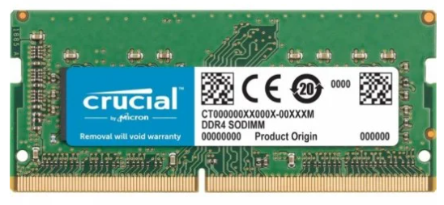

# Unidad 5. Memoria RAM

# Definición de memoria RAM

La RAM o memoria de acceso aleatorio (en inglés: Random Access Memory), es la memoria principal de un equipo microinformático y se encarga de almacenar de manera _temporal_ tanto las instrucciones como los datos que ejecuta el microprocesador.

Es una memoria volátil, es decir, la información se pierde al interrumpirse el flujo eléctrico (apagar el ordenador).

Se denominan «de acceso aleatorio» porque se puede leer o escribir en una posición de memoria con un tiempo de espera igual para cualquier posición.

Físicamente es un conjunto de chips soldados sobre una PCB, a este conjunto de chips, se le denomina _módulo_ de memoria RAM.

Los fabricantes tienen que fabricar los módulos de memoria siguiendo los estándares marcados por _[JEDEC](https://www.jedec.org/_ (Joint Electron Device Engineering Council)

# Estructura módulo memoria RAM

## SPD. Serial Presence Detect chip

**Circuito SPD (Serial Presence Detect chip):** Es el encargado de almacenar datos relativos al módulo de memoria RAM, como el tamaño de la memoria, el tiempo de acceso, la velocidad y el tipo de memoria. De esta forma el ordenador conocerá que memoria RAM tiene instalada de manera automática sin intervención del usuario.

**Circuito SPD (Serial Presence Detect chip):** Es el encargado de almacenar datos relativos al módulo de memoria RAM, como el tamaño de la memoria, el tiempo de acceso, la velocidad y el tipo de memoria. De esta forma el ordenador conocerá que memoria RAM tiene instalada de manera automática sin intervención del usuario.

## PMIC - Power management integrated circuits

**PMIC (Power management integrated circuits o Circuitos integrados de gestión de energía)**

* Exclusivo de DDR5
* Chip situado en el centro de las memorias DDR5 y se encarga de gestionar la energía (voltajes) del módulo
* Permite, entre otras cosas, la implementación de una tecnología de sincronización multifásica. Una novedad que permite realizar transmisiones a un voltaje más bajo o más alto si es necesario. Ahora será siempre gestionado desde el propio módulo de memoria DDR5.

# Making Memory Chips – Process Steps

[https://www.crucial.es/articles/about-memory/how-is-memory-made](https://www.crucial.es/articles/about-memory/how-is-memory-made)

# Estructura interna

* **Bank (Bancos de memoria).** Son los componentes físicos encargados de almacenar los registros de memoria. Lo forman chips de circuitos integrados(IC) que están compuestos en su interior por transistores y capacitores que forman celdas de almacenamiento lo que permite almacenar bits de información dentro de ellos. Un chip contiene varios bancos, cada banco está distribuido en filas y columnas y la intersección de estas son los bits.

* **Rank (Rango de memoria).** El término rango (Rank) fue creado y definido por el JEDEC y es un conjunto de chips conectados entre sí que son accedidos por el controlador de memoria al mismo tiempo formando un bloque o área de datos. El tamaño de un rango es de 64 bits (si tiene ECC se añaden 8 bits más hasta DDR o 2x8=16 bits en DDR5)

### Rank

No todas las memorias tienen el mismo número de chips ni la misma capacidad, es decir, su wide o ancho de bus no es el mismo. En las memorias DDR actuales podemos encontrar chips con un ancho de bus individual de 4, 8 o 16 bits (nomenclaturas de X4, X8 o X16). Cada Rank es un conjunto de chips que forman 64 bits (4 chips de 16 bits, 8 chips de 8 bits o 16 chips de 4 bits)

## Single vs Dual vs Quad Rank 

 Single Rank   : Memoria RAM con un solo bus de datos de 64 bits será determinada como Single Rank o 1R. Un módulo Single Rank tendrá una nomenclatura similar a alguna de estas → 1Rx4, 1Rx8 o 1Rx16. 

 Dual Rank   : Si un módulo tiene 2 buses de datos de 64 bits. (2R) →  2Rx4, 2Rx8 o 2Rx16

 Quad Rank:      Si un módulo tiene 4 buses de datos de 64 bits  . (4R) → 4Rx8 o 4Rx16

> El **Rank** no da pistas claras de la capacidad del módulo de memoria, ya que los chips pueden ser de 512 MB, 1 GB, 2 GB, 4GB o incluso más. Claro que sabiendo los ranks que dispone un módulo y la capacidad, podremos calcular el bus y la capacidad individual de ellos.

# Comunicación memoria-procesador → IMC

**IMC (Integrated Memory Controller)**.  Es el circuito digital situado en el procesador que controla el flujo de datos entre el procesador y la memoria RAM.

Los controladores de memoria contienen la lógica necesaria para leer y escribir en la memoria RAM

* Hasta DDR4 la comunicacción entre el procesador y la memoria es a traves de un bus de 64 bits

  
* En DDR5 la comunicacción entre el procesador y la memoria es a traves de un bus de 2x32 bits.

  

# Single Channel vs Dual Channel

**Single Channel** describe cualquier configuración en la que la CPU solo tiene acceso a un solo bus de 64 bits de ancho en DDR4 o 2x32 en DDR5 para acceder a la memoria.

La tecnología **Dual-Channel** o doble canal es una tecnología que aumenta el rendimiento porque se permite el paso simultáneo a los 2 módulos de memoria RAM duplicando (teóricamente*) el ancho de banda entre la memoria y la CPU pero que en la práctica no pasa de un 20 a 45%.

Para disponer de Dual-Channel, la placa base lo debe soportar. Además hay que instalar 2 módulos de memoria idénticos: mismos timings, capacidad, etc.

# Características de la memoria RAM
## Capacidad

La  capacidad hace referencia a la cantidad de datos que se pueden almacenar en la RAM. La memoria RAM es un almacén de datos y lógicamente una característica importante es cuántos datos puede almacenar. 

Los transistores del interior de los bancos de memoria tienen un determinado tamaño, con lo cual a menor tamaño de transistor mayor densidad de celdas lo que implica más capacidad.

Esta capacidad se mide actualmente en los módulos DDR en **GB (GigaBytes)**.

La cantidad de memoria estará directamente relacionada con el uso que hagas del equipo. Cada uso requiere una cantidad de RAM diferente. No se necesita la misma memoria RAM para navegar, que para jugar o editar vídeo o fotos.

## Velocidad o frecuencia de reloj

* Los chips de memoria integrados en cada módulo de memoria funcionan a una frecuencia de trabajo determinada.
* Este valor se mide en MHz, por lo tanto, a mayor cantidad de Megahercios, mayor velocidad tendrá el módulo.
* En las memorias de tipo DDR (DOUBLE data rate) se realizan 2 operaciones por cada ciclo de reloj  y no una como en las SDR, por tanto  los 3200 MHz anunciados serían en realidad 3200 MT/s (millones de transferencias por segundo) y la frecuencia real sería la mitad, es decir 1600MHz.
* Por ejemplo, 3200 MHz significa que se tardan 1/3200MHz = 0,3125 nanosegundos por cada ciclo de reloj.
* Al elegir la memoria RAM, hay que asegurarse de que la placa base soporta la frecuencia de trabajo de la memoria RAM.
* Al instalar algunos módulos de memoria, la placa puede configurarlos para que trabajen a una frecuencia inferior a la que el fabricante prometía. En ese caso se tendrá que configurar la frecuencia de la memoria RAM manualmente desde la BIOS o UEFI para subir el multiplicador de sus frecuencias y hacer que funcionen a la velocidad correcta.

* SDR vs DDR

## Tasa de transferencia de datos

La **tasa de transferencia de datos** se refiere a cuántos bytes puede transferir un módulo en un tiempo concreto.

POr ejeCrucial DDR4   _2400_   PC4-  19200   4GB →

Tasa de transferencia de datos= 2400Hz*8B = 19200  MB/s

## Ancho de banda

El **ancho de banda máximo de memoria** o **BW (BandWidth)** es la velocidad máxima a la cual el procesador puede leer o almacenar datos en una memoria. Actualmente se mide en GB/s.

El ancho de banda máximo teórico de la memoria se puede calcular multiplicando la frecuencia real de la memoria multiplicado por el número de bytes de ancho (64) y multiplicado por el número de canales (o interfaces) compatibles con el  procesador.

La frecuencia de reloj DRAM de la RAM -> Dato de fabricante/2

* Ancho Bus de la memoria -> actualmente y desde hace años es de 64 bits por canal (32*2 en DDR5) 

* Número ciclo de reloj -> SDR=1 (1 operación por ciclo) y DDR =2 (2 operaciones por ciclo )

* Número de canales (Interfaces) -> o lo que es igual, el número de canales máximos de memoria que pueden funcionar al mismo tiempo. Esto lo determina la plataforma en sí misma, donde actualmente en escritorio tenemos(Single-Channel = 1) (Dual-Channel = 2) disponibles.

BW = FrecuenciaReal*64*Número de ciclos de reloj*Canales  

> Ejemplo:
Team Group Delta White RGB DDR4 3200 PC4-25600  → Frecuencia real=3200Mhz/2=1600Mhz 

BW(Dual-Channel)=160000000*64*2*2= 409.600.000.000 bits por segundo
Divimos entre 8 para pasar a bytes 
BW= 51,2 GB/s 

## Latencia

La estructura interna de la memoria RAM es como la de un tablero de ajedrez tridimensional en el que cada cuadro del tablero es una celda en la que se escriben los datos que se almacenan.

La latencia es el tiempo que tarda la memoria RAM en situarse en una determinada celda para leer o escribir su contenido. Cuanto mayor sea la latencia de la memoria RAM, mayor es el tiempo que “pierde” en llegar a una determinada celda y, por lo tanto, menos eficiente en su trabajo.

Por lo tanto, a igualdad de frecuencias de reloj para un módulo de memoria RAM, es preferible elegir una memoria RAM con una latencia baja.

_[https://pcpro.es/guias/latencia-memoria-ram-que-es-y-tipos/](https://pcpro.es/guias/latencia-memoria-ram-que-es-y-tipos/)_

**Timings.**  Suelen visualizarse en formato numérico: 9-9-9-24 es un ejemplo de tiempos o timings de una memoria DDR.

¿Qué significa cada uno de los cuatro números? 
* Latencia CAS (Column Address Strobe) (CL):      Ciclos de reloj que pasan desde que se realiza una petición para leer o escribir un dato hasta que dicha información está disponible, o los ciclos de reloj que transcurre entre que el controlador de memoria envía una petición para leer una posición de memoria y el momento en que los datos son enviados a los pines de salida del módulo.  _Es el dato más importante de esta lista de números._ 
  * Los tipos de memoria nueva suelen tener una latencia CAS mucho más alta que sus modelos comparables más antiguos.
* _[https://www.crucial.es/articles/about-memory/difference-between-speed-and-latency](https://www.crucial.es/articles/about-memory/difference-between-speed-and-latency)_   
*  Retardo de columna y fila (tRCD o Time RAS to CAS Delay)   : Número mínimo de ciclos de reloj necesarios para abrir una fila y acceder a una columna. Se puede considerar el tiempo mínimo que tarda la RAM en llegar a la nueva dirección. El tiempo para leer el primer bit de memoria de una DRAM sin ninguna fila activa seria tRCD + CL
*  Tiempo de precarga de fila (tRP o Time RAS Precharge):    Tiempo que tarda la memoria en tener lista una fila nueva para usar datos. Significa básicamente el tiempo que tarda en hacer un salto de línea es decir estoy leyendo la fila "5" y paso a la fila "6" el TRP mide el tiempo que tardó en hacer ese cambio de fila "5" a fila "6".
*  Tiempo activo de fila (tRAS):    Número mínimo de ciclos para los que debe estar activa una fila para garantizar que tengamos tiempo suficiente para acceder a la información que contiene.

_[Corsair Value Select DDR4 2666Mhz PC4-21300 8GB CL18](https://www.memoryc.com/24306-8gb-corsair-valueselect-ddr4-2666mhz-cl18-memory-module.html)_

| Memoria | Velocidad de reloj(MT/s) | Frecuencia real(MHz) | Ciclo de reloj (ns) | Latencia CAS | Latencia real (ns) |
| :-: | :-: | :-: | :-: | :-: | :-: |
| DD4 | 2666 | 1333 | 0.75 | 18 | 13.5 |

Latencia real   (ns)   = tiempo de ciclo de reloj   (ns)   x números de ciclos de reloj(CAS)

Frecuencia real: 2666(MT/s) /2 =  1333MHz

Ciclo de reloj=1/1333x10  6  Hz  = 0.75x10  -9  s=  0.75ns

Latencia real= 0.75nsx18=  13.5ns

## Voltaje

El voltaje es el valor de tensión a la que el módulo de memoria RAM trabaja.

Disminuye a la vez que la tecnología avanza, es decir el consumo de los módulos DDR5 es inferior al de los módulos DDR4.

## Tipos de memoria RAM

* Static RAM (SRAM).
  * Comenzó a utilizarse en 1990 y a día de hoy sigue presente en cámaras digitales, routers o impresoras.
  * Las ventajas de este tipo de memoria es que consume muy poca energía y tiene unos tiempos de acceso muy bajos. Las desventajas incluyen que tienen unas capacidades muy bajas, y unos costes de fabricación bastante elevados.
  * Capaz de mantener los datos, mientras siga alimentada, sin necesidad de circuito de refresco.
*  Dynamic RAM (DRAM) 
  * Puede aceptar una orden de lectura antes de haber terminado de procesar una de escritura (pipelining) lo que posibilita la ejecución de varias instrucciones simultáneamente.
  * Basada en condensadores, los cuales pierden su carga progresivamente, necesitando de un circuito dinámico de refresco cada cierto período
*  Synchronous Dynamic RAM (SDRAM) 
  * Variante mejorada de la memoria SDRAM que mejora la manera en la que procesa la información de lectura y escritura. «Single Data Rate» significa que se ejecuta una instrucción de lectura y otra de escritura por cada ciclo de reloj del procesador.
*  Single Data Rate Synchronous Dynamic RAM (SDR SDRAM) 
  * Segunda generación de memoria SDRAM.
*  Double Data Rate Synchronous Dynamic RAM (DDR SDRAM) 
  * Se estandarizó a partir del año 2000.
  * Opera de la misma manera que la SDR SDRAM solo que el doble de rápido, es decir, es capaz de realizar dos instrucciones de lectura y dos de escritura por cada ciclo de reloj del procesador.

### Tipos de DDR SDRAM

 Memoria RAM DDR: 

 Memoria RAM DDR2: 

 Memoria RAM DDR3   :

 Memoria RAM DDR4: 

 Memoria RAM DDR5: 

## Factor de forma

* **DIMM:** El término    DIMM    es el acrónimo de la expresión “Dual In-line Memory Module”
* **SO-DIMM:** “Small Outline Dual In-line Memory Module”, y es precisamente esas palabras «Small Outline» lo que las diferencia de los módulos DIMM habituales. La diferencia es meramente física, ocupan un menor espacio y así se pueden instalar en equipos de tamaño reducido como los portátiles.

### Tipos de DDR SDRAM en formato DIMM

 Longitud: 133,35 mm

Pines: 

DDR:  184 pines

DDR2: 240 pines 

DDR3: 240 pines 

DDR4: 288 pines

DDR5: 288 pines 

| Tipo | Pines | Longitud |
| :-: | :-: | :-: |
| SO-DIMM DDR | 200 | 67.6 mm |
| SO-DIMM DDR2 | 200 | 67.6 mm |
| SO-DIMM DDR3 | 204 | 67.6 mm |
| SO-DIMM DDR4 | 260 | 69.6 mm |
| SO-DIMM DDR5 | 262 |  |

_[Detalle de la muesca](https://upload.wikimedia.org/wikipedia/commons/9/95/Laptop_SODIMM_DDR_Memory_Comparison_V2.svg)_

## RAM ECC

En la memoria principal, los contenidos son almacenados en forma de código binario, en otras palabras, están compuestos por unos y ceros para que el ordenador pueda procesarlos. Los dígitos binarios se conocen como bits. Factores como (fluctuaciones del voltaje, overclocking, módulos de memoria defectuosos y viejos, o radiación de alta energía) pueden generar un error de bit. Estos fallos de bit se presentan cuando un bit toma el valor falso, es decir “1” en vez de “0” y viceversa. En muchas aplicaciones, las consecuencias de estos fallos son apenas perceptibles, pero en otros ámbitos esos fallos no son asumibles

La solución a este problema se llama    Error Correcting Code    (ECC), un código que tiene la capacidad de detectar y corregir errores de bit

La memoria ECC (Error Correcting Code) o código de corrección de errores es un tipo de memoria de ordenador que detecta y corrige los tipos más comunes de corrupción de datos de la memoria.

El Rank contiene 8 bits de memoria adicionales, lo que hace un total de 72 bits.

El Rank en DDR5 contiene 2*8 bits de memoria adicionales, lo que hace un total de 80 bits.

A medida que se procesan los datos, la memoria ECC está constantemente analizando código con un algoritmo especial para detectar y corregir errores de memoria de un solo bit → (  _[código Hamming](https://es.wikipedia.org/wiki/C%C3%B3digo_Hamming)_  )

Se utiliza en servidores, sitios con información sensible o cálculos complejos.

Generalmente, la memoria ECC es más cara y puede ser un poco más lenta que la memoria normal.

Los demás componentes del sistema, como la CPU y la placa base, también deben ser compatibles con una memoria ECC.

_Cuando no está presente esta tecnología puede venir indicado como _  _Non-ECC_  _._

## RAM Buffered/Registered

La Memoria RAM “Buffered” o Memoria “Registered” tiene un registro situado entre la DRAM y el Controlador de Memoria del Sistema. Esto hace que haya menos carga eléctrica en el Controlador de Memoria y permite que sistemas con muchos módulos de memoria permanezcan estables, de otra forma esto no sería posible. 

Más cara de construir y utilizada en servidores.

Cuando se fabrica como un módulo de memoria dual en línea (DIMM), un módulo de memoria registrado se denomina RDIMM , mientras que la memoria no registrada se denomina UDIMM o simplemente DIMM

Cuando no poseen esta característica nos puede venir indicado como    _Unbuffered o Unregistered_   .

## Perfiles

* La memoria está preparada para trabajar a diferentes frecuencias y diferentes latencias. Cada configuración de frecuencias, latencias y voltaje se conoce como perfil, y el fabricante asegura que el rendimiento es óptimo con esos perfiles. Estos perfiles se almacenan en el circuito SPD de la memoria.
* Existen dos tipos de perfiles, dentro de cada tipo, el fabricante puede configurar diferentes variantes.
* Perfiles JEDEC: son configuraciones aprobadas por el organismo encargado de la estandarización de la memoria RAM. Estas configuraciones son muy seguras pero no aprovechan las altas frecuencias de las memorias RAM actuales. Suelen venir indicadas con un número, por ejemplo, JEDEC #4, JEDEC #5, etc.
* Perfiles XMP (Intel eXtreme Memory Performance) o DOCP/EXPO (AMD): son configuraciones aprobadas por Intel  y AMD  para conseguir obtener frecuencias de funcionamiento de la memoria superiores a las aprobadas por JEDEC. Suelen venir indicadas con un número, por ejemplo, XMP-3200, XMP-4000, etc.
  * _[https://www.asus.com/latin/support/FAQ/1042256/](https://www.asus.com/latin/support/FAQ/1042256/)_
* Por defecto la placa base sólo funciona con perfiles JEDEC, detectando automáticamente el perfil que mejor rendimiento tenga. Si la placa base está preparada para admitir perfiles XMP o  DOCP/EXPO , estos se podrán configurar desde la BIOS/ UEFI .

# Identificación de RAM

_[https://www.kingston.com/spain/es/memory/memory-part-number-decoder](https://www.kingston.com/spain/es/memory/memory-part-number-decoder)_   

## Etiquetas

 KVR32N22D8/16 (  _[http://www.kingston.com/dataSheets/KVR32N22D8_16.pdf](http://www.kingston.com/dataSheets/KVR32N22D8_16.pdf)_   )

KVR. Corresponde a las iniciales del fabricante (Kingston)

32. Corresponde a la velocidad efectiva en MHz (3200MHz)

N. NonECC (No corrige errores). Si fuera E (ECC) corrige errores.

22. Latencia (CAS).

D. Dual Channel. Si fuera S (Single), Q(Quad)

8. Número de chips de memoria.

16. Capacidad del módulo (16GB)

 KVR16N11K2/16 (  _[http://www.kingston.com/dataSheets/KVR16N11K2_16.pdf](http://www.kingston.com/dataSheets/KVR16N11K2_16.pdf)_   )

KVR. Corresponde a las iniciales del fabricante (Kingston)

16. Corresponde a la velocidad efectiva en MHz (1600MHz)

N. NonECC (No corrige errores). Si fuera E (ECC) corrige errores.

11. Latencia (CAS).

K2. Kit de 2 piezas

16. Capacidad del módulo (16GB)

 KVR26S19S8/16 (  _[http://www.kingston.com/dataSheets/KVR26S19S8_16.pdf](http://www.kingston.com/dataSheets/KVR26S19S8_16.pdf)_   )

KVR. Corresponde a las iniciales del fabricante (Kingston)

26. Corresponde a la velocidad efectiva en MHz (2600MHz)

S. Tipo de módulo SODIMM

19. Latencia (CAS).

S. SODIMM

8. Número de chips de memoria.

16. Capacidad del módulo (16GB)

CT32G4S266M (  _[https://www.crucial.es/memory/ddr4/ct32g4s266m](https://www.crucial.es/memory/ddr4/ct32g4s266m)_   )

CT. Crucial

32G. Capacidad del módulo (32GB)

S. SODIMM

266. Velocidad efectiva (2666MHz)

M. compatible con MAC

 CT32G4DFD8266 (  _[https://www.crucial.es/memory/ddr4/ct32g4dfd8266](https://www.crucial.es/memory/ddr4/ct32g4dfd8266)_   )

CT. Crucial

32G. Capacidad del módulo (32GB)

4DF

D8. Dual Channel

266. Velocidad efectiva (2666MHz)

 CMK64GX4M4B3600C18 (  _[https://www.corsair.com/es/es/Categor%C3%ADas/Productos/Memoria/VENGEANCELPX/p/CMK64GX4M4B3600C18#tab-tech-specs](https://www.corsair.com/es/es/Categor%C3%ADas/Productos/Memoria/VENGEANCELPX/p/CMK64GX4M4B3600C18#tab-tech-specs)_   )

CMK. Corsair

64GX4M4. Kit de 64 GB (4x16GB cada uno)

3600. Corresponde a la velocidad efectiva en MHz (3600MHz)

18. Latencia (CAS).

# ¿Cómo saber qué memoria tengo instalada?

¿Cómo saber qué memoria tengo instalada? Podemos usar software de terceros o acceder al símbolo de sistema (Windows+r→cmd→y ejecutar “wmic memorychip”

# VRAM

Video Ram o memoria de vídeo está presente en todas las tarjetas gráficas, es un tipo de memoria diseñada especialmente para llevar a cabo un tipo concreto de tareas en aplicaciones gráficas y videojuegos.

GDDR SDRAM, es el tipo de RAM de gráficos más popular, y es lo que encontrará en la gran mayoría de las GPUs actuales. La abreviatura significa Graphics Double Data Rate Synchronous Dynamic Random-Access Memory

HBM(High Bandwidth Memory), tipo de memoria gráfica que tiene un ancho de banda mucho mayor que GDDR6, alto coste (HBM,   _[HBM2](https://www.pccomponentes.com/amd-radeon-pro-wx-9100-16gb-gddr5-hbm2)_  ,   _[HBM2E](https://hardzone.es/tutoriales/rendimiento/memoria-hbm2e-caracteristicas-especificaciones/)_  )

# Bibliografia

_[https://computerhoy.com/reportajes/tecnologia/latencia-vs-megahercios-importante-elegir-ram-pc-420979](https://computerhoy.com/reportajes/tecnologia/latencia-vs-megahercios-importante-elegir-ram-pc-420979)_

_[https://computerhoy.com/noticias/hardware/todo-que-necesitas-saber-memoria-ram-37541](https://computerhoy.com/noticias/hardware/todo-que-necesitas-saber-memoria-ram-37541)_

_[https://hardzone.es/2018/01/17/asi-funciona-atencia-memoria-ram-ddr4/](https://hardzone.es/2018/01/17/asi-funciona-atencia-memoria-ram-ddr4/)_   

_[https://www.profesionalreview.com/2018/07/21/latencia-memoria-ram/](https://www.profesionalreview.com/2018/07/21/latencia-memoria-ram/)_

_[https://www.anandtech.com/show/3851/everything-you-always-wanted-to-know-about-sdram-memory-but-were-afraid-to-ask/2](https://www.anandtech.com/show/3851/everything-you-always-wanted-to-know-about-sdram-memory-but-were-afraid-to-ask/2)_   

_[https://hardzone.es/2019/01/06/single-rank-vs-dual-rank-amd-ryzen/](https://hardzone.es/2019/01/06/single-rank-vs-dual-rank-amd-ryzen/)_   

_[https://hardzone.es/tutoriales/componentes/tipos-memoria-ram-pc-historia/](https://hardzone.es/tutoriales/componentes/tipos-memoria-ram-pc-historia/)_

_[https://hardzone.es/tutoriales/componentes/diferencias-memoria-ram-ddr/](https://hardzone.es/tutoriales/componentes/diferencias-memoria-ram-ddr/)_

_[https://lau-re.wixsite.com/laure/post/dimm-vs-so-dimm-hay-diferencia-de-rendimiento](https://lau-re.wixsite.com/laure/post/dimm-vs-so-dimm-hay-diferencia-de-rendimiento)_

_[https://www.ionos.es/digitalguide/servidores/know-how/memoria-ecc-almacenamiento-seguro-de-datos/](https://www.ionos.es/digitalguide/servidores/know-how/memoria-ecc-almacenamiento-seguro-de-datos/)_   

_[https://infopcgamer.com/gddr5-vs-gddr5x-vs-hbm-vs-hbm2-vs-gddr6/](https://infopcgamer.com/gddr5-vs-gddr5x-vs-hbm-vs-hbm2-vs-gddr6/)_   

_[https://hardzone.es/reportajes/que-es/vram-tarjeta-grafica/](https://hardzone.es/reportajes/que-es/vram-tarjeta-grafica/)_   

_[https://www.ticarte.com/contenido/especificaciones-tecnicas-de-la-memoria-ram](https://www.ticarte.com/contenido/especificaciones-tecnicas-de-la-memoria-ram)_   

