# Unidad 6. Dispositivos de almacenamiento

# Definición

Los dispositivos de almacenamiento de un equipo microinformático, también conocidos como memoria secundaria, es el lugar donde se almacenan permanentemente los programas y datos con los que se trabaja en el mismo. Se caracteriza por tener gran capacidad de almacenamiento, ser no volátil y por un tiempo de acceso más lento que el acceso a la memoria principal.

# Unidad de almacenamiento principal

Actualmete los dispositivos de almacenamiento secundario principal en un equipo microinformático y donde se suele instalar el sistema operativo, además de tener la posibilidad de almacenar programas y datos son los **discos duros magnéticos o HDD (Hard Disk Drive)** y las **unidades de estado sólido o SDD (Solid State Drive)**

Sus características principales son:

* Gran capacidad de almacenamiento.
* No volátil.
* Acceso más lento que la memoria principal(RAM).

## Disco duro magnético. Estructura mecánica

* Un disco duro magnético está formado por uno o varios **discos** (o <strong>platos</strong>), normalmente de aluminio, que en su superficie se almacena la información ya que están recubiertos con un material <strong>magnetizable</strong>.
* Estos platos están fijados en el centro a un eje donde hay un **motor de rotación** cuya misión es hacerlos girar al unísono a gran velocidad (<strong>rpm</strong>).
* Sobre los discos existen unos **brazos** encargados de moverse sobre toda la superficie del disco gracias a otro motor diferente.
* En los extremos de estos brazos se instalan las **cabezas (heads)** que son las que realizan las funciones de \*\*lectura y escritura\*\*.
* Las cabezas se mueven a través de la superficie de los platos por la acción del <strong>impulsor de cabeza</strong>.
* La **controladora** es una placa electrónica encargada de sincronizar todas las acciones para conseguir la lectura/escritura, y comunicarse con el resto del sistema a través del <strong>interfaz</strong>.
* <strong>Caché</strong>. Las unidades actuales tienen un chip de memoria integrada en el circuito electrónico. Éste hace las veces de puente de intercambio de información desde los platos físicos hasta la memoria RAM.  Es como un búfer dinámico para aligerar el acceso a la información física y suele ser de 64 MB.
* Todos los elementos anteriores se aglutinan en una <strong>caja sellada</strong>, para evitar la entrada de polvo y suciedad

### Disco o platos magnetizables

### Brazos

### Motor

El motor gira a una determinadas **RPM: revoluciones por minuto**

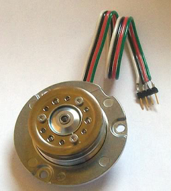

### Cabezas

### Cabezas lecto/escritoras

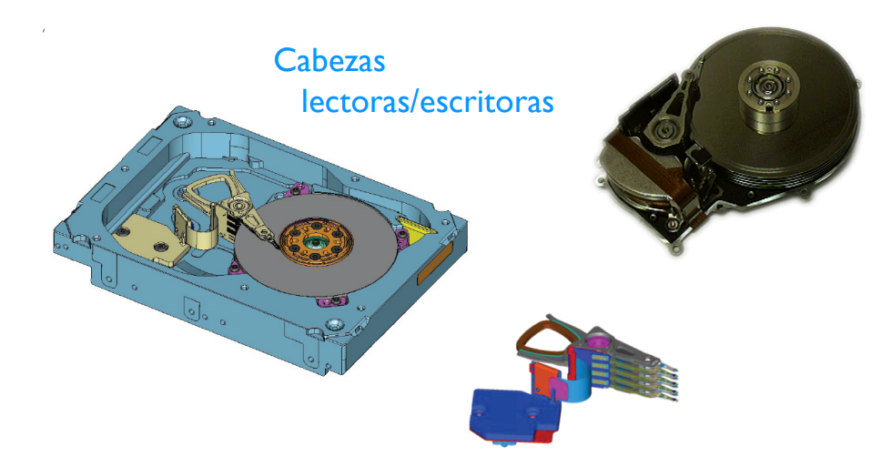

### Controladora de disco

## Estructura física

* **Pistas.** Son los distintos anillos concéntricos invisibles a lo largo de los cuales se graban los pulsos magnéticos.
* **Sectores.** Las distintas partes en las que se subdivide cada pista. En el caso de los discos duros el número oscila entre los 15 y los 63 sectores. El tamaño físico de un sector es de <strong>512 bytes</strong>.
* **Cilindros.** Es el conjunto de pistas a las que el SO puede acceder simultáneamente en cada posición de cabezas. (En el caso de un disco con dos platillos, el cilindro constará de 4 pistas). Así se accede más rápidamente al no tener que desplazar el cabezal. En ocasiones se habla de número de cilindros por cara
* **Clúster.** Conjunto contiguo de sectores que componen la unidad más pequeña de almacenamiento de un disco.

    > Los archivos se almacenan en uno o varios clústeres, dependiendo de su tamaño.

    > En Windows → [Tamaño de asignación](https://www.xataka.com/basics/tamano-unidad-asignacion-disco-duro-que-cual-mejor-escoger)

Tamaño de la unidad de asignación en Windows = Tamaño lógico del cluster

[Tamaño predeterminado del tamaño de asignación en Windows](https://support.microsoft.com/es-es/topic/tama%C3%B1o-de-cl%C3%BAster-predeterminado-para-ntfs-fat-y-exfat-9772e6f1-e31a-00d7-e18f-73169155af95)

## Mecanismo de lectura/escritura

Los diferentes platos que forman el disco giran a una velocidad constante y no cesan mientras el disco duro está recibiendo energía. Cada cara del plato tiene asignada una de las cabezas de lectura/escritura. La cabeza se mueve desde el interior al exterior del plato. Gracias a este movimiento de las cabezas y al giro de los platos se consigue acceder a todos los sectores.

Los brazos que poseen las cabezas se mueven todos al unísono hacia el interior o exterior del plato, como si fueran los dientes de un peine. Por tanto, todas las cabezas van a estar leyendo los sectores que forman el cilindro virtual. De ahí que el proceso de lectura y escritura se haga al mismo tiempo en los sectores de cada pista que forma el cilindro.

Las cabezas, gracias al mismo aire que provoca el giro de los platos, flotarán sobre la superficie de ellos, siempre sin tocarla. Cualquier mínimo contacto podría dañar la superficie y dejar el disco duro inutilizable.

### Geometría o direccionamiento de los HDD

Hace referencia al número físico real de cabezas, cilindros, pistas y sectores. La capacidad del disco se puede calcular si se conocen estos valores. Se distingue entre:

* **CHS** (Cylinder Head Sector)\*\* (cilindro cabeza sector). Con estos tres valores se puede situar un sector cualquiera del disco. → Es un método de direccionamiento obsoleto
* **LBA (Logical Block Addressing)** (direccionamiento lógico de bloques), que consiste en dividir el disco entero en sectores y asignar a cada uno un único número. Este es el que actualmente se usa.

LBA0 representa el primer sector lógico del dispositivo

La capacidad del disco se puede calcular si se conocen estos valores que normalmente podemos encontrar en la etiqueta de los discos. 

> **Recordatorio:** El tamaño físico de un sector es de 512 bytes.

  

$Capacidad(CHS) = C*H*S*512B$

Ejemplo CHS &rarr; $Capacidad=19.390*16*63*512B=10.007.101.440B ≈ 10GB$

$Capacidad (LBA) = SectoresLBA*512B$

Ejemplo LBA &rarr; $Capacidad = 3.907.029.168*512B=2.000.398.934.016B ≈ 2TB$

# SSD.

**SSD (Solid State Drive - Unidad de Estado Sólido)** utilizan memorias de tipo **flash NAND**.

**Ventajas:**

* Velocidad o Tasa de transferencia de datos. Tanto en la búsqueda de los datos como en las lecturas posteriores. En una unidad de este tipo el tiempo que tienes que esperar hasta obtener los datos es siempre el mismo (similar a la RAM). 
* Mayor resistencia a golpes. Al no tener componentes móviles responden mejor tanto a las vibraciones como a los golpes.
* Menor consumo de energía. Necesitan menos potencia para funcionar al no disponer de partes móviles
* Menor ruido. Otra ventaja más de no tener partes móviles.
* No tiene fragmentación.

**Inconvenientes:**

* Precio por bit mayor.
* Menor capacidad.
* Sus celdas pueden reescribirse un número limitado de veces.

## Estructura interna

* **Controlador (Controller)**: El controlador es el cerebro de la unidad SSD. Se encarga de gestionar las operaciones de lectura y escritura, así como de llevar a cabo la administración de la memoria. Además, controla la interfaz de conexión con la placa madre, que suele ser SATA, PCIe o NVMe.
* **Chips de memoria NAND Flash:** La memoria NAND Flash es el componente fundamental de almacenamiento en una SSD. Está compuesta por celdas de memoria que retienen los datos de forma no volátil. Hay varios tipos de memoria NAND.
* **Cache DRAM** : Algunas SSDs incorporan una memoria caché DRAM (memoria de acceso aleatorio dinámica) para mejorar el rendimiento. Esta memoria se utiliza para almacenar temporalmente datos que se acceden con frecuencia, acelerando las operaciones de lectura y escritura.
* **Conector:** Las SSDs se conectan a la placa madre a través de un conector que puede ser SATA (o mSATA), NVMe o incluso PCI-E, dependiendo del modelo y la interfaz de conexión utilizada.
* **Firmware:** El firmware es el software interno que reside en la SSD y es gestionado por el controlador. Este software controla las operaciones, la gestión de errores y las funciones avanzadas de la unidad SSD.

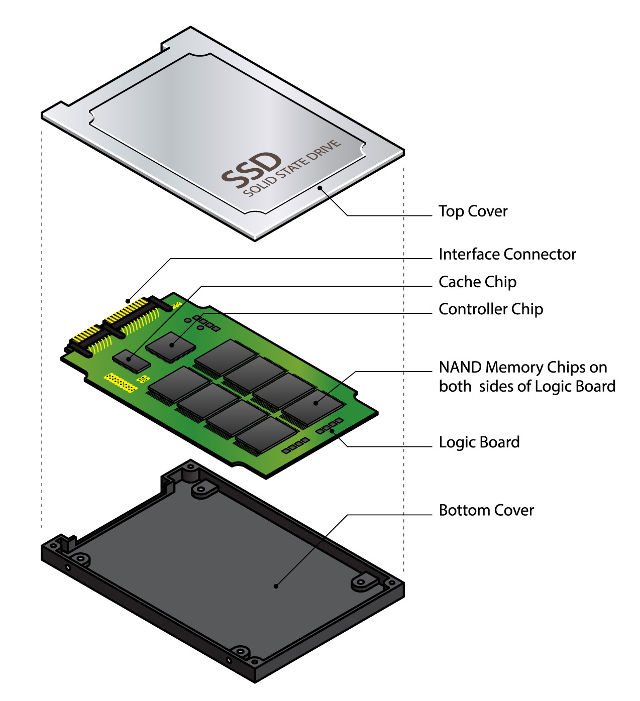

## Tipos de conexión

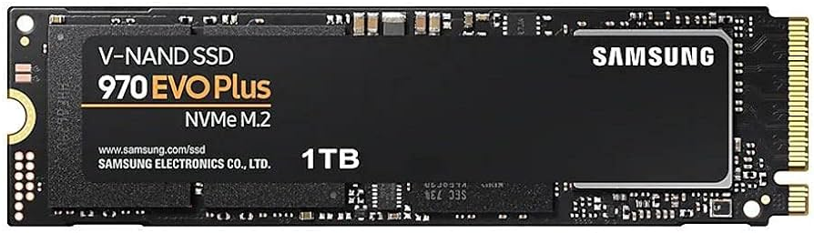

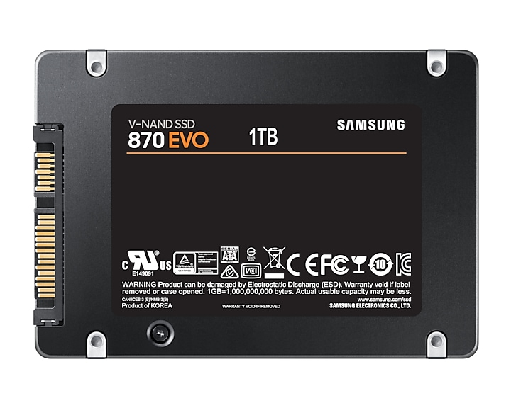

## Chips de memoria NAND FLASH

Los chips de estas memorias basan su estructura en transistores de puerta flotante (floating gate). La diferencia entre este tipo de transistores y los que usan la memoria DRAM, es que estos últimos deben tener una carga eléctrica con una frecuencia de refresco constante para mantener los datos almacenados. Este es el motivo por el que la memoria RAM de nuestro ordenador se vacía al apagar el ordenador.

La memoria NAND está diseñada para mantener su estado de carga aun cuando no está recibiendo corriente eléctrica, con lo que se consigue mantener la información. Por lo tanto, es un tipo de memoria no volátil

Los electrones son almacenados en el puente flotante (Flaoting Gate), de forma que toma una lectura de 0 cuando está cargado, o 1 si está vacío. Son unos valores opuestos a lo que se suelen utilizar. De ahí el nombre Negated AND

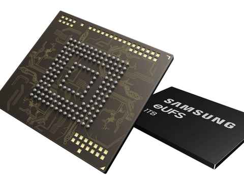

Los transistores que componen la memoria almacenan la información en  celdas  en las que se almacenan datos en forma de voltajes. Dichas celdas forman matrices o bloques de las que a cada fila se le conoce como  página ;

**¿En cada celda se almacena un bit?**

## Chips de memoria

* **NAND SLC (Single Level  Cell)** - *Ventaja: Mayor resistencia - Desventaja: Cara y de baja capacidad*

La NAND SLC almacena 1 bit de información por celda. La celda guarda un 0 o un 1 y, en consecuencia, los datos pueden escribirse y recuperarse más rápido. SLC ofrece el mejor rendimiento y la mayor resistencia con 100.000 ciclos de P/E ( *[Ciclo de programación de borrado](https://uruguayoc.wordpress.com/2018/02/23/que-es-un-p-e-cycle-o-ciclo-de-programacion-borrado-de-una-celda-de-memoria-nand-flash/)* ) por lo cual durará más que otros tipos de NAND. Sin embargo, por su baja densidad el SLC es el tipo de NAND más caro y, por consiguiente, no suele utilizarse en productos de consumo. Normalmente se emplea en servidores y otras aplicaciones industriales que requieren rapidez y durabilidad.

* **NAND MLC (Multi Level  Cell)** - *Ventaja: Más barato que SLC - Desventaja: Más lento y menos resistente que SLC*

La NAND MLD almacena 2 bits por celda (00, 01, 10 y 11), lo cual se traduce en poder almacenar el doble de información que un SLC en el mismo espacio. Debido a esto MLC tiene una mayor densidad de datos que SLC y, por consiguiente, puede producirse con mayores capacidades. MLC se caracteriza por una buena combinación de precio, rendimiento y resistencia. No obstante, MLC es más sensible a errores de datos, con 10.000 ciclos de P/E por consiguiente, su resistencia es inferior a SLC. Normalmente, MLC se utiliza en productos de consumo en los que la resistencia es menos importante.

* **NAND TLC** (Triple Level  Cell) - *Ventaja: Más barata y mayor capacidad - Desventaja: Baja resistencia*

La NAND TLC (celda de triple nivel) guarda 3 bits por celda, es decir, hasta 8 estados diferentes. Al agregarse más bits por celda, el costo se reduce y la capacidad se incrementa. No obstante, esto tiene efectos negativos en el rendimiento y en la resistencia, con solamente 3.000 ciclos de P/E. Muchos productos de consumo emplean TLC, dado que es la opción más barata.

* **NAND QLC**

Cada celda almacena 4 bits, lo que significa 16 estados de voltaje.

https://www.profesionalreview.com/2024/01/30/samsung-memorias-nand-qlc-280-capas/

* **NAND 3D**

Las celdas se apilan también verticalmente (3D) y no solo a lo largo y ancho (2D). Esto permite hacer las celdas más grandes y, por lo tanto, mejor aisladas, minimizando los defectos de las memorias TLC considerablemente, y acercándolas a las MLC en durabilidad. La mayor densidad de memoria posibilita mayores capacidades de almacenamiento sin un enorme incremento de precio. Por otra parte, NAND 3D se caracteriza por su mayor resistencia y menor consumo eléctrico.

# Características generales de las unidades de almacenamiento

* Interfaz. ( Conexión al PC o dispositivo ). Podemos encontrar discos duros con la interfaz IDE, SATA, SCSI, SAS o SATA Express, pero también interfaces de conexión externos como USB, Thunderbolt, Firewire o eSATA.
* Factor de forma: El factor de forma nos da las dimensiones del disco duro. Se mide en pulgadas, las cuales indican el diámetro de los platos (en el caso de que lleven). Podemos encontrar los siguientes factores de forma
    * 3,5" pulgadas o LFF
    * 2,5" pulgadas o SFF
    * M.2
    * U.2
    * U.3
* Capacidad de almacenamiento. Se mide GB o TB
* Memoria caché. La memoria caché del disco duro almacenará la información más solicitada, de manera que la controladora pueda acceder a ella de manera más rápida sin tener que ir a leerla internamente. Esta memoria se mide en Megabytes.
* Tiempo de acceso. El tiempo de acceso es el tiempo medio que tarda el disco duro en estar preparado para transferir datos (ya sea de lectura o de escritura). Este tiempo se mide en nanosegundos (ns)
* Velocidad de rotación del motor de los discos duros magnéticos. Marca la velocidad de giro en los discos duros magnéticos. Los discos con interfaz IDE y SATA giran a 5.400 o 7.200 rpm (revoluciones por minuto). En los discos duros con interfaz SCSI o SAS las velocidades de giro son mayores, de 10.000 e incluso 15.000 rpm, aunque son ruidosos y consumen más energía.
* Velocidad lectura/escritura \_\_en discos SSD. Velocidad a la que el disco es capaz de leer y escribir información. 
* Temperatura. Indica el rango de temperaturas a las que el disco puede funcionar.
* Nivel sonoro: Nos indica el nivel de ruido que emitirá el disco duro en funcionamiento. Se mide en decibelios (dB).
* Resistencia a golpes: Mediría el golpe máximo que el disco duro es capaz de soportar sin romperse. Se utiliza la medida de fuerza (G), donde 1G es la fuerza de la gravedad cuando estás parado, sentado o acostado.
* Vida útil - Terabytes Written (TBW ). Se define por el JEDEC como el número de terabytes que pueden ser escritos en un SSD hasta que sus células de memoria se «agoten»
* Tiempo medio entre fallos - Mean Time Between Failures (MTBF) \_\_en discos SSD.
* Humedad. Indica el rango de humedad a las que el disco puede funcionar.
* Altitud. Indica el rango de altitud a las que el disco puede funcionar.

# Interfaces de dispositivos de almacenamiento

## **IDE (Integrated Drive Electronics)

Ha sido la interfaz más utilizada hasta hace pocos años para la conexión de dispositivos de almacenamiento en los equipos microinformáticos. Aunque actualmente no se fabrican dispositivos para esta interfaz, es muy común encontrarnos equipos antiguos que la utilicen.

Cada conector IDE de la placa base admite como máximo dos dispositivos IDE, como por ejemplo dos discos duros, o un disco y una unidad de DVD-ROM o CD. Uno se identificará como maestro (master) y otro como esclavo (slave). Para configurar un dispositivo IDE como maestro y esclavo se utilizan jumpers (o puentes) que se sitúan en la parte posterior del disco.

La conexión de datos del dispositivo IDE a la placa base se hará mediante un cable plano que posee conectores de 40 pines

Para suministrar energía al dispositivo se utiliza el conector Molex que parte directamente de la fuente de alimentación.

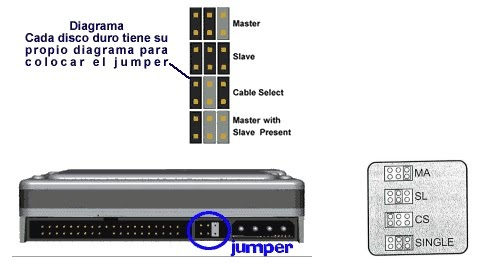

## Interfaz SATA

El interfaz SATA (Serial Advanced Technology Attachment), es el sustituto de IDE para conectar dispositivos de almacenamiento en los equipos microinformáticos (Discos duros/Unidades ópticas)

**Estándares:**

La velocidad de transferencia efectiva sólo tiene en cuenta los datos finales del usuario, mientras que la velocidad de transferencia en bruto cuenta también los bits de control del interfaz (bit de arranque y bit de parada).

Los cables de datos solo poseen dos conectores, uno en cada extremo, por lo que sólo se podrá conectar un dispositivo SATA a cada uno de los conectores de la placa base. Por tanto, el concepto de maestro y esclavo desaparece en esta interfaz. El conector de datos tiene un ancho de 1 mm y está compuesto de 7 hilos.

Conector de alimentación SATA directo desde la fuente.

## Interfaz NVMe - M.2

**NVMe** son las siglas de «Non-Volatile Memory Express», o memoria exprés no volátil.

Utiliza la tecnología PCI-Express lo que le permite al disco duro ofrecer un ancho de banda mucho más amplio en *[comparación con la interfaz SATA.](https://www.geeknetic.es/Guia/2189/SSD-M2-NVMe-y-SATA-Caracteristicas-y-Diferencias.html)*

¿Qué diferencias de velocidades hay entre SSD PCIe 3.0 vs 4.0 vs 5.0?

* Alrededor de 3500 MB/s de lectura/escritura en SSD PCIe 3.0 NVMe.
* En torno a los 7000 MB/s de lectura/escritura en SSD PCIe 4.0 NVMe.
* Unos 12.000 MB/s de lectura/escritura en SSD PCIe 5.0.

## Interfaz SCSI

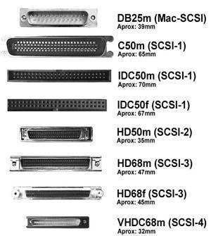

La interfaz SCSI (Small Computers System Interface - Interfaz de Sistema para Pequeñas Computadoras). Todo lo contrario a lo que su nombre indica, se utilizaba en entorno profesionales.

Los discos duros de esta interfaz son más caros y suelen ser más rápidos a la hora de transmitir datos ya que usan menos el microprocesador para esa tarea.

Actualmente este interfaz está obsoleto, y ha dado paso a su sucesor SAS.

Utiliza el modo de transmisión paralelo y permite la conexión de hasta 16 dispositivos, incluida la controladora.

Las placas bases no solían disponer de conectores SCSI integrados, por lo que se necesitaba una tarjeta de expansión SCSI adicional para poder conectarlos.

## Interfaz SAS

El interfaz SAS (Serial Attached SCSI) es una interfaz de conexión de dispositivos de almacenamiento que ha sido la sucesora del interfaz SCSI. → Servidores

Aumenta la velocidad de transferencia al aumentar el número de dispositivos conectados, hasta 128 dispositivos

Las placas base no suelen tener este tipo de controladoras integradas, necesitando tarjetas de expansión adicionales para poder utilizar este tipo de interfaz.

Similar al conector de la interfaz SATA, pero el conector del disco duro posee una particularidad, el conector de datos y el de alimentación están unidos sin separación entre ellos. Debido a esta particularidad, los discos duros SATA pueden ser utilizados en una controladoras SAS, pero no a la inversa

## Interfaz U.2

la interfaz U.2 permite conectar dispositivos de almacenamiento a través del bus PCIe mediante un conector de factor de forma pequeño (SFF) que también es compatible con discos mecánicos SAS y SATA. Dicho de otra manera, esta interfaz permite utilizar SSD en formatos estándar de 2,5″ pero con interfaz PCI-Express.
La interfaz U.2 hoy en día está completamente en desuso en el ámbito del mercado de consumo pero que se sigue utilizando en el empresarial (Servidores y Data Centers)

## Interfaz U.3

Evolución de U.2

### Interfaces para unidades de almacenamiento externas

USB

Thunderbolt

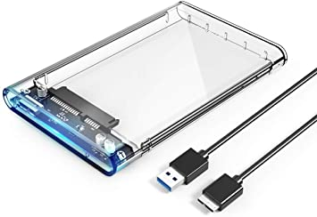

## Factor de forma

### Factor de forma 3\,5” o LFF

3.5" o 3.5 pulgadas o LFF(Large Form Factor) Se refiere a los discos duros "grandes" usados comúnmente en los ordenadores de sobremesa y servidores.

Discos duros actuales →  Interfaz SATA / SAS

Medidas típicas de 101 x 25,4 x 146 mm.

### Factor de forma 2\,5” o SFF

2.5" o 2.5 pulgadas o SFF(Short Form Factor) Se refiere a los discos duros "grandes" usados comúnmente en los ordenadores de sobremesa y servidores

Suelen tener unas dimensiones de 6,9 x 10 x 9,7 centímetros

Podemos encontrar unidades de 2.5” tanto magnéticos, SSD SATA o SSD U.2

Actualmente → Interfaz SATA.

### NVMe M.2

El formato **NVMe M.2** se ha convertido en el más popular para la construcción de discos SSD de altas prestaciones, pues permite la construcción de modelos muy rápidos, con una alta capacidad y con un tamaño muy reducido.

Se conectan mediante tecnología PCI-Express a la placa base para evitar los cuellos de botella.

Se elimina el conector de la alimentación, pues los M.2 se alimentan directamente desde la ranura PCI Express X4. (Actualmente existe PCI Express V5)

Dentro del formato M.2 existen varios tipos, por ejemplo M.2 2242, M.2 2260 y M.2 2280, esto hace referencia a las dimensiones del dispositivo, en el primer caso son 22 mm de ancho x 42 mm de largo mientras que en el segundo tiene un largo de 60 mm y el último un largo de 80 mm.

# Dispositivos de almacenamiento en red

## NAS
El almacenamiento conectado en red, Network Attached Storage (NAS), es el nombre dado a una tecnología de almacenamiento dedicada a compartir la capacidad de almacenamiento de un computador/ordenador (servidor) con computadoras personales o servidores clientes a través de una red (normalmente TCP/IP), haciendo uso de un sistema operativo optimizado para dar acceso con los protocolos CIFS, NFS, FTP o TFTP.

Suelen tener varios discos y se pueden configurar en *[RAID](https://es.wikipedia.org/wiki/RAID)*

Hay discos duros exclusivos para NAS que tienen más durabilidad, los discos utilizados suelen ser magnéticos de 3,5”

## Cabina de discos. Servidores de almacenamiento

*[https://www1.la.dell.com/ue/es/gen/Empresarial/pvaul_md1000/pd.aspx?refid=pvaul_md1000&s=gen](https://www1.la.dell.com/ue/es/gen/Empresarial/pvaul_md1000/pd.aspx?refid=pvaul_md1000&s=gen)*

# RAID

Un RAID es un grupo de discos duros independientes configurados para funcionar como uno solo, ya sea sumando su espacio total, mejorando la velocidad de lectura y escritura o configurados para duplicar la información para estar seguros de que, en caso de que uno de los discos duros se rompa, no vamos a perder los datos.

Existen varios tipo de RAID

## RAID 0

En esta configuración todos los discos duros funcionan como un único volumen, y su espacio total es la suma del espacio de todos los discos duros.

Doble velocidad de lectura y escritura.

No hay paridad de datos ni volumen de respaldo.

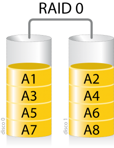

## RAID 1

Es uno de los tipos de RAID más utilizados para quienes buscan duplicidad de los datos para estar seguros de que los datos nunca se pierden. En este tipo de RAID, los datos se duplican en los discos duros como si fuese un espejo.

Mayor velocidad de lectura. Sin mejora en la velocidad de escritura.

Un disco duro espejo. Si falla uno de los discos duros se puede reemplazar sin perder datos.

Perdemos el 50% del espacio total de los discos. El espacio total de un RAID 1 es la mitad del espacio total de los discos duros. Por ejemplo, si hacemos un RAID 1 con dos discos duros de 4 TB solo tendremos un espacio total de 4 TB.

## RAID 5

La información se distribuye a lo largo de todos los discos duros, aunque se reserva dicho espacio (el tamaño de una de las unidades) para paridad. Esta paridad, además, se reparte entre todos los discos duros.

Si fallan dos discos se pierde absolutamente toda la información del RAID.

La mejora de velocidad de lectura es también X-1 veces el número de discos usados.

El espacio total de los discos es X-1, El espacio total de un RAID 5 es el espacio de todos los discos duros menos 1, es decir, si vamos a usar 4 discos duros de 4 TB el espacio total será de 12 TB.

Si falla uno de los discos duros, cualquiera de ellos, se puede reemplazar y recuperar todos los datos.

## RAID 6

Prácticamente igual que el RAID 5, pero añade un segundo nivel de paridad, lo que nos permite que fallen hasta dos discos duros del RAID y poder sustituirlos. Si fallan 3, entonces toda la información del RAID se pierde.

El espacio total de los discos es X-2, igual que la mejora de la velocidad de lectura. A cambio de esta doble paridad incluida en el RAID 6 se pierde el espacio total de dos de los discos duros. Por ejemplo, en una configuración de 4 discos duros de 4 TB, el espacio total que tendríamos es de 8 TB, con el doble de velocidad de lectura.

# Almacenamiento en la nube

Un sistema de almacenamiento en la nube o Cloud Storage es un modelo de almacenamiento de datos basado en redes de ordenadores donde nuestros datos están alojados en espacios de almacenamiento virtualizados. Por lo tanto, el espacio no se encuentra en el propio equipo físico del usuario, sino en uno o varios servidores ofrecidos por la compañía que contratemos el servicio.

## Ventajas 

### Rentabilidad

Con el almacenamiento en la nube, no hay que comprar hardware, ni aprovisionar almacenamiento, ni utilizar capital adicional para los picos de la empresa. Puede agregar o eliminar capacidad de almacenamiento bajo demanda, cambiar rápidamente las características de rendimiento y retención, y pagar solo por el almacenamiento que realmente utiliza. A medida que se accede a los datos con poca frecuencia y en contadas ocasiones, puede incluso trasladarlos automáticamente a un almacenamiento de menor costo, con lo que se consigue un ahorro de costos aún mayor. Al trasladar las cargas de trabajo de almacenamiento de las instalaciones a la nube, puede reducir el costo total de propiedad al eliminar el exceso de aprovisionamiento y el costo de mantenimiento de la infraestructura de almacenamiento.

### Mayor agilidad

Con el almacenamiento en la nube, los recursos están a un solo clic. Se reduce el tiempo para poner esos recursos a disposición de su organización de semanas a solo minutos. Esto se traduce en un aumento espectacular de la agilidad de su organización. El personal se libera en gran medida de las tareas de adquisición, instalación, administración y mantenimiento. Y como el almacenamiento en la nube se integra con una amplia gama de herramientas de análisis, su personal puede ahora extraer más información de sus datos para impulsar la innovación.

### Despliegue más rápido

Cuando los equipos de desarrollo están listos para comenzar, la infraestructura nunca debería ralentizarlos. Los servicios de almacenamiento en la nube permiten al Departamento de TI suministrar rápidamente la cantidad exacta de almacenamiento que se necesita, cuando y donde sea necesario. Los desarrolladores pueden centrarse en resolver problemas complejos de las aplicaciones en vez de tener que administrar los sistemas de almacenamiento.

### Administración eficiente de los datos

Al utilizar políticas de administración del ciclo de vida del almacenamiento en la nube, puede realizar potentes tareas de administración de la información, incluida la separación por niveles automatizada o el bloqueo de datos para cumplir con los requisitos de conformidad. También puede utilizar el almacenamiento en la nube para crear un almacenamiento multirregional o global para sus equipos distribuidos mediante el uso de herramientas como la replicación. Puede organizar y administrar los datos de manera que admitan casos de uso específicos, creen eficiencias de costos, refuercen la seguridad y cumplan con los requisitos de conformidad.

### Escalabilidad 
El almacenamiento en la nube ofrece una capacidad de almacenamiento casi ilimitada, lo que le permite escalar verticalmente tanto y tan rápido como necesite. Esto elimina las limitaciones de la capacidad de almacenamiento local. Puede escalar o desescalar verticalmente de forma eficaz el almacenamiento en la nube según sea necesario para los análisis, los lagos de datos, copias de seguridad o aplicaciones nativas de la nube. Los usuarios pueden acceder al almacenamiento desde cualquier lugar y en cualquier momento, sin preocuparse de los complejos procesos de asignación de almacenamiento ni de esperar a que haya nuevo hardware

# Memorias Flash

Es una memoria de tipo EEPROM (Electrically-Erasable Programmable Read-Only Memory).

## Características

* Gran resistencia a los golpes.
* Bajo consumo.
* Silencioso, (no contiene partes móviles).
* Pequeño tamaño y ligereza.
* Gran versatilidad (cámaras digitales, teléfonos móviles, etc.)

## Formatos:

* **Secure Digital (SD)**
* **Pendrive (memorias USB)**
* CompactFlash (CF)
* SmartMedia Card (SMC)
* Memory Stick (MS)
* Multimedia Card o MMC.
* xD-Picture Card (xD)

## Memorias Flash SD

Secure Digital (SD)* es un formato de tarjeta de memoria para dispositivos portátiles, cámaras digitales (fotográficas o video), teléfonos móviles, ordenadores portátiles etc..

SD Association - *[https://www.sdcard.org/](https://www.sdcard.org/)* style="color:#333333">

 ### Versiones:

 ### Factor de forma

### Clasificación

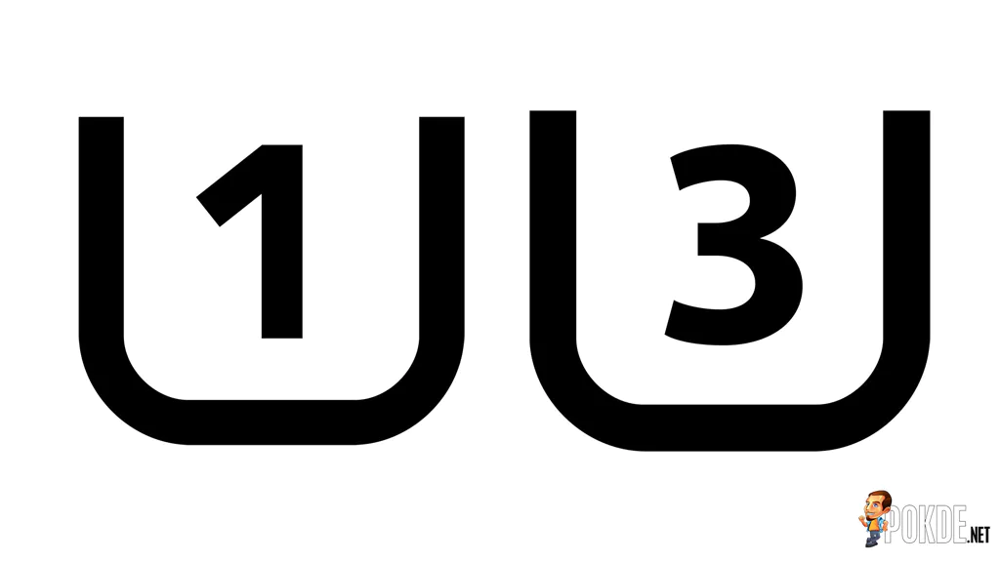

Las tarjetas SD también pueden diferenciarse por su clase para grabación de vídeo:

 

# 10.2 Memorias Flash. Pendrive

Unidad de almacenamiento de datos que puedes conectar a ordenadores u otros dispositivos electrónicos, desde móviles hasta televisores o consolas, mediante su conector USB (Clase A o clase C), de ahí que se le conozca también como memoria USB.

Sus capacidades y velocidades de transmisión de datos dependen de cada uno de los modelos, ya que cada fabricante ofrece diferentes tamaños, y con el paso del tiempo las velocidades han ido aumentando.

Aquí, el almacenamiento de cada pendrive lo puedes formatear con diferentes tipos de *[sistema de archivos](https://www.xataka.com/basics/megaguia-formatos-que-sistema-archivos-formatear-usb-disco-duro-uso-que-vas-a-darle)* style="color:#333333">,

Usos:

Llevar documentos o archivos multimedia para leerlos en cualquier ordenador u otro dispositivo

Guardar copias de seguridad.

Crear un USB booteable, que puede servir para reparar tu sistema operativo o para instalar otro sistema operativo en el ordenador

Utilizar el pendrive como llave de seguridad, que sirve para verificar tu identidad en procesos de identificación en dos pasos.

# Unidades ópticas

Las unidades de almacenamiento óptico son aquellas que son capaces de leer y escribir datos por medio de un rayo láser en un soporte óptico, ya que se almacenan por medio de ranuras microscópicas quemadas. La información queda grabada en la superficie de manera física, por lo que solo el calor (puede producir deformaciones en la superficie del disco) y las ralladuras pueden producir la pérdida de los datos, en cambio es inmune a los campos magnéticos y la humedad.

Los discos compactos (CD), discos versátiles digitales (DVD) y discos Blu-ray (BD) son los tipos de medios ópticos más comunes que pueden ser leídos y grabados por estas unidades.

## CD-ROM

* El CD-ROM ( style="color:#202124">Compact Disc Read-Only Memory style="color:#333333">) estándar fue establecido en 1985 por Sony y Philips.
* Actualmente en desuso al menos en los equipos microinformáticos
* Conexiones: IDE-SATA o externos
* Puede albergar 650 ( style="color:#333333">74 minutos de música style="color:#333333">) o 700 MB de datos (80 minutos de música) y los especiales de gran capacidad pueden llegar a los 800 y 900 MB.
* Existen los siguientes formatos:
    * CD-ROM (CD Read Only Memory)
    * CD-DA (Compact Disk Digital Audio)
    * CD-R (CD Recordable)
    * CD-RW (CD Rewritable)
* Un CD de audio se reproduce a una velocidad tal que se leen 150 **[KB](https://es.wikipedia.org/wiki/Kilobyte)** por segundo. Esta velocidad base se usa como referencia para identificar otros lectores como los de <strong>[ordenador](https://es.wikipedia.org/wiki/Computadora_electr%C3%B3nica)</strong>, de modo que si un lector indica 24x, significa que puede llegar a leer hasta 24 x 150 KB/S = 3.600 KB/<strong>[s](https://es.wikipedia.org/wiki/Segundo)</strong>

Velocidad de lectura/escritura CD CAV (Constant Angular Velocity)

Si un lector indica 24x, significa que puede llegar a leer hasta:

Velocidad = 24 x 150 KB = 3.600 KB/s

## DVD

* Digital Versatile Disc (disco versátil digital)
* 1995→ style="color:#202122"> *DVD Consortium*
* Un DVD puede tener dos capas y dos caras, su capacidad va de 4,7 GB a 17 GB
* Pueden leer y escribir\* también CDs
* La velocidad de transferencia de datos de una unidad DVD está dada en múltiplos de 1350 KB/s
* Existen los siguientes formatos:
    * DVD-ROM
    * DVD-Vídeo
    * DVD-Audio
    * DVD-R (recordable) / DVD+R
    * DVD-RW (rewritable) / DVD+RW
    * DVD-R DL (dual layer) / DVD+R DL
* .

## Blu-Ray

* La tecnología Blu-Ray (https://us.blu-raydisc.com/) hace uso de un rayo láser de color style="color:#0000FF">azul style="color:#333333">con una longitud de onda de 405 nanómetros. style="color:#0645AD"> *[¿Por qué es azul?](https://www.adslzone.net/2017/10/30/por-que-laser-blu-ray-azul/)*
* Desarrollado por la Blu-ray Disc Association (BDA) (2002)
* La capacidad del Blu-ray es de 25 GB para una capa, 50 GB para doble capa , 100 GB para triple capa y 128 GB para cuádruple capa (BD-XL)
* Los usos principales del Blu-ray son la grabación y, la distribución del vídeo de alta definición, el almacenamiento de datos y la gestión de activos digitales. Por otro lado, uno de los usos más recurrentes son los videojuegos
* Existen los siguientes formatos:
    * BD-ROM
    * BD-R (recordable)
    * BD-RE (rewritable)
* La velocidad de transferencia va a venir expresada por un número seguido de una “X”. En este caso la “X” se refiere a una velocidad de 4,5MB/s. Actualmente existen unidades lectoras de BD con una velocidad de 12x.
* Pueden leer y escribir\* también CD y DVD

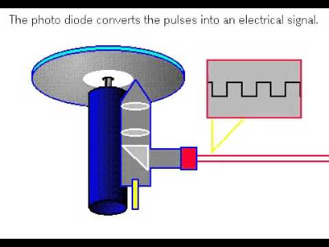

## Comparación

# Cintas magnéticas

Las cintas magnéticas de almacenamiento de datos han sido usadas para el almacenamiento de datos durante los últimos 50 años.

Las cintas magnéticas son un tipo de medio o soporte de almacenamiento de datos que se graba en pistas sobre una banda plástica con un material magnetizado.

Se mantienen como una alternativa a los discos debido a su bajo coste por bit.

Se utilizan para copias de seguridad.

La grabación y lectura se efectúan de forma secuencial, que significa que para encontrar algo que está en medio de la cinta debes “hacerla avanzar” previamente hasta que el cabezal de lectoescritura se posicione sobre el lugar correcto, proceso que puede demorar varios minutos

# Cintas magnéticas.LTO

 **Linear Tape-Open (LTO)** es una tecnología de cinta magnética de almacenamiento de datos, desarrollada originalmente a finales de 1990.

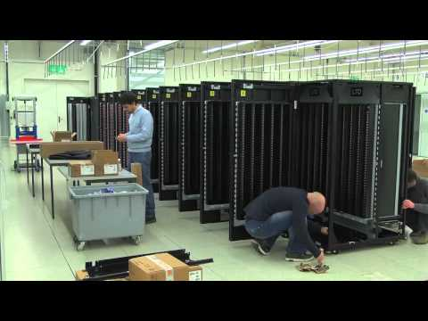

https://www.youtube.com/watch?v=hY5OmDLJJPU 

# Estructura lógica de los discos

La estructura de partición . Se encarga de definir cómo se organiza la información en el disco duro. Independientemente del hardware o del sistema operativo, todas las computadoras se inician utilizando MBR (BIOS) o GPT (UEFI) .

Espacio particionado . Es el espacio del disco que ha sido asignado a alguna partición. Una partición es una división del disco duro, de forma que el sistema operativo la considera como si fuera una unidad totalmente independiente. Algunos usuarios prefieren tener particiones independientes para los datos personales, los programas y los archivos del sistema operativo.

Espacio sin particionar. Es espacio no accesible del disco ya que todavía no ha sido asignado a ninguna partición y está sin formatear.

## MBR \(Master Boot Record\)

* En discos duros que tienen tabla de particiones con el esquema MBR, cuando se crean las particiones, se graba dicha información en el sector de arranque del disco (MBR). Básicamente, el MBR es un tipo especial de sector de arranque que se encuentra en el comienzo de los dispositivos de almacenamiento de datos particionados, como un disco duro fijo o una unidad de almacenamiento externa, y que contiene una tabla de particiones que indica el lugar del disco donde se encuentran las particiones. Normalmente, en dicha tabla se guarda información sobre:
    * el tipo de partición,
    * el tamaño de la partición (se indica dónde empieza y dónde acaba cada partición),
    * si es o no la partición activa (que es la que está configurada para arrancar).
* De esta forma, cuando arranca un ordenador la BIOS intenta localizar el MBR donde identifica la partición definida como activa y se inicia el proceso de arranque. Dicho de otra forma, el MBR apunta a la partición activa y el equipo comenzará a cargar el sistema operativo almacenado en esa partición activa o un menú de arranque que permita elegir el sistema operativo (si tiene varios instalados) a arrancar.

* Tamaño de 512 bytes
* Consta de tres partes
    * Master Boot Code o cargador de arranque (446 bytes). Contiene códigos y datos que la BIOS necesita para iniciar la carga del sistema operativo (SO).
    * Tabla de particiones (64 Bytes). Posee información sobre las distribuciones del disco duro. Información de hasta 4 particiones de 16 bytes cada una.
    * Firma (2 bytes) → 0x5AA. Los sistemas operativos utilizan la firma de disco para identificar y diferenciar diferentes dispositivos de almacenamiento de datos y unidades de disco duro en la computadora para el acceso a los datos.

## GPT (GUID Partition Table)

** GPT (GUID Partition Table)** es un nuevo estándar para colocar tablas de particiones en medios de almacenamiento. Forma parte de la (UEFI).

GPT se localiza al comienzo del disco duro ( *[Primary GUID](https://es.wikipedia.org/wiki/Tabla_de_particiones_GUID)* ), al igual que el MBR, pero no en el primero, sino en el segundo sector. El primer sector todavía está reservado para MBR (Protective MBR) por motivos de seguridad y para conservar la compatibilidad con sistemas más antiguos.

Los datos críticos para el funcionamiento de la plataforma se almacenan en particiones en lugar de hacerlo en sectores ocultos o no particionados (como en el caso de MBR). Además, los discos GPT incluyen tablas de partición principales redundantes (Primary GUID) y de copia de seguridad (Backup GUID) a fin de mejorar la integridad de la estructura de datos de la partición.

MBR &rarr; BIOS // GPT &rarr; UEFI

> ¿Qué pasa si se corrompe MBR?

> ¿Qué pasa si se corrompe GPT?

## Tipos de particiones

### Partición primaria.

Puede ser reconocida como una partición de arranque y puede contener un sistema operativo que realice el arranque del equipo. Una de las particiones primarias se llama la partición activa y es la de arranque. El ordenador busca en esa partición activa el arranque del sistema. Cuando hay varios sistemas operativos instalados la partición activa tiene un pequeño programa llamado gestor de arranque que presenta un pequeño menú que permite elegir qué sistema operativo se arranca. Los sistemas operativos detectarán las particiones primarias y les asignará una unidad. Límite de 4 en MBR y 128 en GPT.

### Partición extendida.

También conocida como partición secundaria, sirve para contener múltiples unidades lógicas en su interior. Fue ideada para romper la limitación de 4 particiones primarias en un solo disco físico por tanto sólo se utiliza en MBR. Solo puede existir una partición de este tipo por disco, y solo sirve para contener particiones lógicas. Por lo tanto, es el único tipo de partición que style="color:#333333"> *no* style="color:#333333"> soporta un sistema de archivos directamente. No se puede instalar un sistema operativo en ella. style="color:#333333"> *Solo aplicable a MBR.*

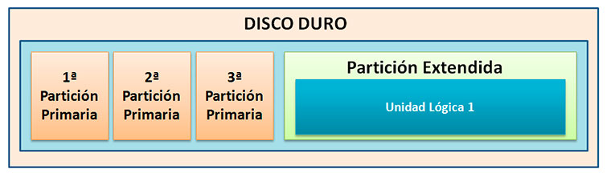

Disco duro con tres particiones primarias y una extendida.

### Partición lógica.

Ocupa una porción de la partición extendida o la totalidad de la misma, y se puede formatear con un sistema de archivos diferente (FAT32, NTFS, ext3, ext4, etc.) y se le asignan una unidad, así el sistema operativo reconoce las particiones lógicas o su sistema de archivos. **Solo aplicable a MBR.**

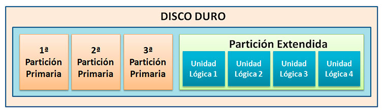

Disco duro MBR con tres particiones primarias y una extendida con cuatro lógicas

**Disk Management - Administrador de discos**

# Sistema de archivos

El sistema de archivos o File System es un método para el almacenamiento y organización de archivos y los datos que estos contienen, para hacer más fácil la tarea encontrarlos y acceder a ellos.

Para ello, el sistema operativo utiliza las famosas “carpetas” o “directorios” con el fin de organizar todas las rutas y localizar la información contenida en el disco duro.

La estructura de directorios suele ser jerárquica, ramificada o en árbol invertido.

Los principales tipos sistemas de archivos que encontramos son los siguientes:

* NTFS (New Technology File System).
* HPFS (High Performance File System).
* EXT (Extended file System).
* HFS+ (Hierarchical File System).
* APFS (Apple File System).
* FAT (File Allocation Table).
* exFAT (Extended File Allocation)
* FAT32.
* ReFS

Para saber cuál de estos tipos debemos elegir debemos saber el sistema operativo que estamos usando o usaremos Windows, Linux o MacOS. Esto es importante porque hay algunos sistemas de ficheros que no son compatibles con algunos sistemas operativos:

* Windows: NTFS, FAT32 y exFAT
* Linux: EXT4, NTFS, exFAT y FAT32
* MacOS: APFS, HFS, HFS EXT4 y NTFS con limitaciones.

# Comandos disco duro

Info del disco: wmic diskdrive get caption,serialnumber

Espacio libre: fsutil volume diskfree c:

# Bibliografía

[https://www.ticarte.com/contenido/caracteristicas-fisicas-de-los-discos-duros-magneticos](https://www.ticarte.com/contenido/caracteristicas-fisicas-de-los-discos-duros-magneticos)

[https://www.adslzone.net/reportajes/internet/comparativa-almacenamiento-nube/](https://www.adslzone.net/reportajes/internet/comparativa-almacenamiento-nube/)

[https://www.seagate.com/es/es/tech-insights/what-is-nas-master-ti/](https://www.seagate.com/es/es/tech-insights/what-is-nas-master-ti/)

[https://pokde.net/system/pc/storage/sd-card-types-speed-class-explained](https://pokde.net/system/pc/storage/sd-card-types-speed-class-explained)

[https://www.xataka.com/basics/tipos-tarjetas-sd-que-significan-sus-clases-tipos-numeraciones](https://www.xataka.com/basics/tipos-tarjetas-sd-que-significan-sus-clases-tipos-numeraciones)

[https://www.xataka.com/basics/pen-drive-memoria-usb-que-sirve](https://www.xataka.com/basics/pen-drive-memoria-usb-que-sirve)

[https://es.wikipedia.org/wiki/Disco_compacto](https://es.wikipedia.org/wiki/Disco_compacto)

[https://hardzone.es/reportajes/que-es/que-es-blu-ray/](https://hardzone.es/reportajes/que-es/que-es-blu-ray/)

[https://www.ticarte.com/contenido/el-cd-rom-dvd-y-blu-ray-de-los-equipos-microinformaticos](https://www.ticarte.com/contenido/el-cd-rom-dvd-y-blu-ray-de-los-equipos-microinformaticos)

[http://cuartoinformatica.tecnojulio.com/2015/10/22/estructura-logica-del-disco-duro-actividad_12/](http://cuartoinformatica.tecnojulio.com/2015/10/22/estructura-logica-del-disco-duro-actividad_12/)

[http://www.carm.es/edu/pub/04_2015/2_5_2_contenido.html](http://www.carm.es/edu/pub/04_2015/2_5_2_contenido.html)

[https://informaticoalrescate.com/2019/08/08/diferencias-entre-los-sistemas-de-archivos/](https://informaticoalrescate.com/2019/08/08/diferencias-entre-los-sistemas-de-archivos/)

[https://www.kingston.com/spain/es/solutions/pc-performance/difference-between-slc-mlc-tlc-3d-nand#:~:text=SLC%20ofrece%20el%20mejor%20rendimiento,utilizarse%20en%20productos%20de%20consumo](https://www.kingston.com/spain/es/solutions/pc-performance/difference-between-slc-mlc-tlc-3d-nand#:~:text=SLC%20ofrece%20el%20mejor%20rendimiento,utilizarse%20en%20productos%20de%20consumo)\_ .

[https://www.profesionalreview.com/2018/03/10/discos-mbr-y-gtp-diferencias-entre-los-dos-estandares-de-la-actualidad/](https://www.profesionalreview.com/2018/03/10/discos-mbr-y-gtp-diferencias-entre-los-dos-estandares-de-la-actualidad/)

[http://www.carm.es/edu/pub/04_2015/2_5_1_contenido.htmlb](http://www.carm.es/edu/pub/04_2015/2_5_1_contenido.htmlb)

[https://www.idiskhome.com/resource/backup/mbr-vs-gpt.shtml](https://www.idiskhome.com/resource/backup/mbr-vs-gpt.shtml)

[https://www.profesionalreview.com/disco-duro/](https://www.profesionalreview.com/disco-duro/)

[https://www.diskmfr.com/know-how-internal-structure-details-of-solid-state-drives/](https://www.diskmfr.com/know-how-internal-structure-details-of-solid-state-drives/)

[https://computerhoy.com/noticias/hardware/que-es-ssd-como-funciona-que-tipos-existen-50726](https://computerhoy.com/noticias/hardware/que-es-ssd-como-funciona-que-tipos-existen-50726)

https://gamersnexus.net/guides/1497-ssd-architecture-1-what-is-tlc-nand-mlc-anatomy

https://www.profesionalreview.com/2023/01/22/u-2-vs-u-3/
