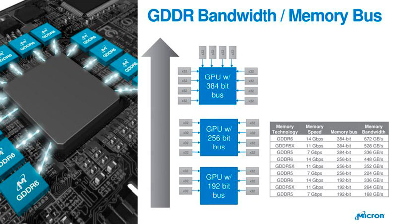
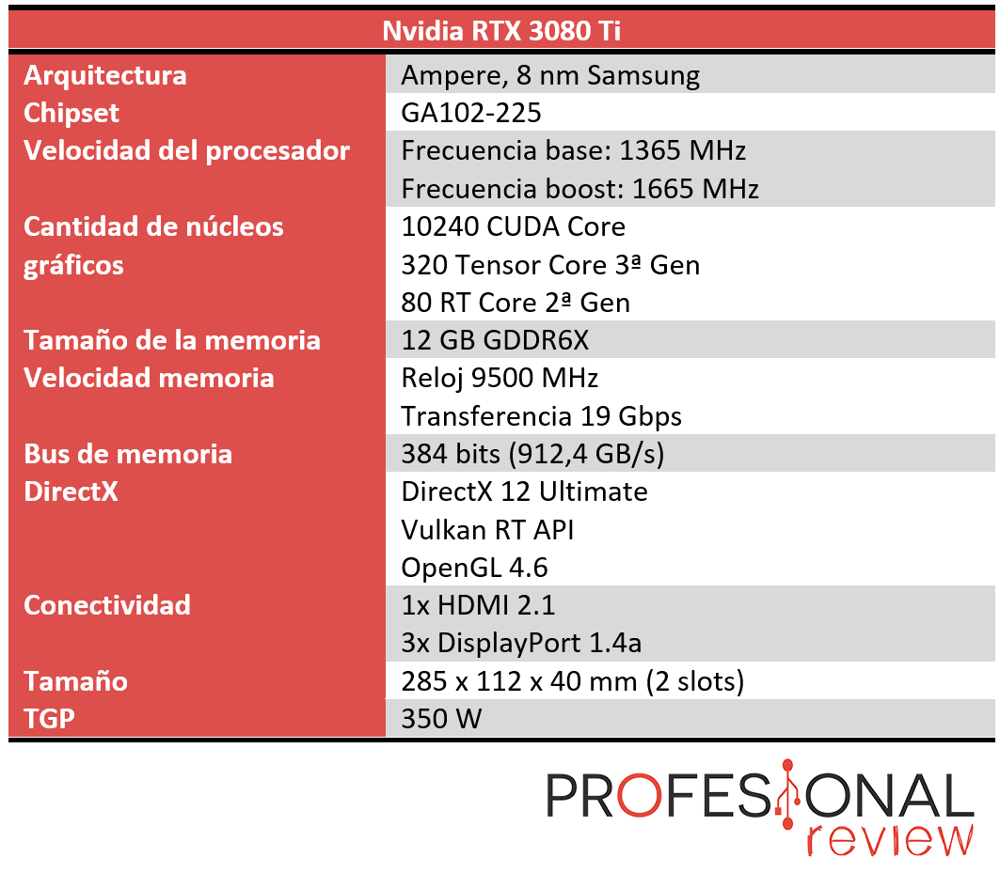
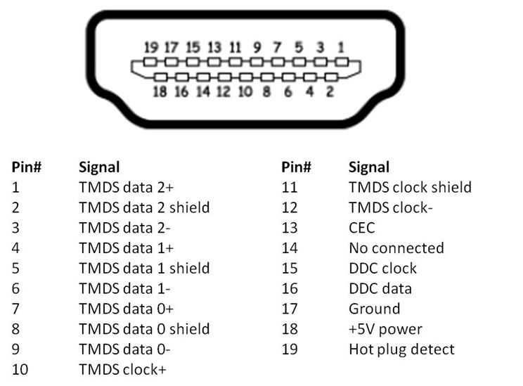
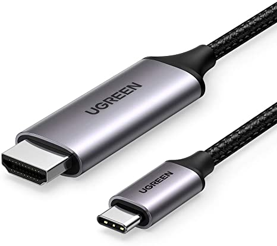
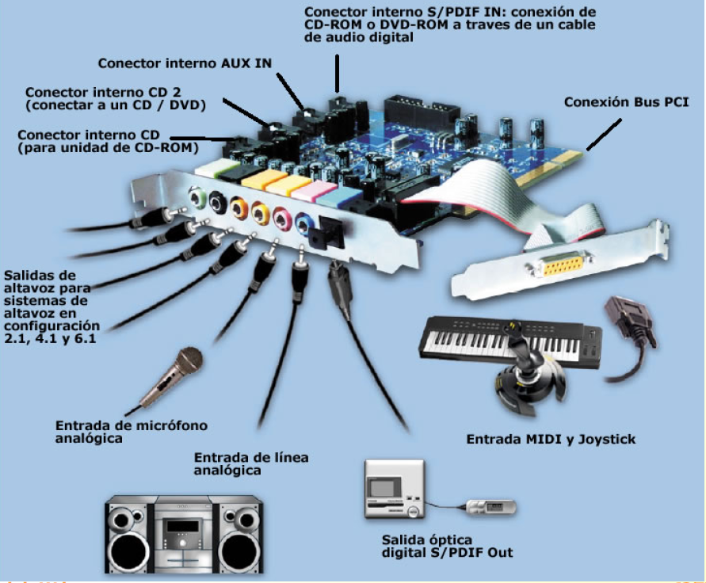
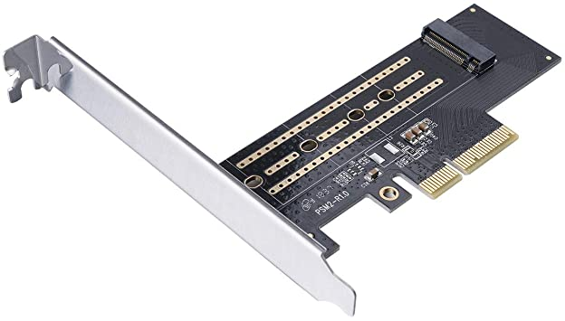

# U7- Adaptadores gráficos, red y multimedia

# Tarjetas gráficas

La tarjeta gráfica, también llamada tarjeta de vídeo, adaptador de pantalla o simplemente GPU (heredado del nombre de su procesador gráfico) es una tarjeta de expansión o un circuito integrado que se encarga de procesar los datos que le envía el procesador del ordenador y transformarlos en información visible y comprensible para el usuario, representándolos en el dispositivo de salida, el monitor.

Tipos:
* Integradas en CPU(iGPU - Integrated GPU): Estas gráficas integradas tienen normalmente una potencia reducida y además necesitan recursos de memoria RAM del sistema.
  * Intel
  * Amd → APU
  * Apple M
* Tarjetas de expansión
  * PCI-Express x16
  * PCI → Obsoleto
  * AGP → Obsoleto

## Componentes tarjetas gráficas

### GPU - Graphics Processing Unit

La GPU, o Unidad de Procesamiento de Gráficos, se encarga de procesar los gráficos que utiliza el sistema de computación, es decir es una unidad de procesamiento gráfico con una alta capacidad de paralelizado, capaz de trabajar y de procesar gráficos, y de convertir información y datos en elementos visibles por el usuario, pero que también de sacar adelante tareas que requieran de la realización de una gran cantidad de operaciones concurrentes en paralelo

Físicamente es un circuito muy complejo que integra varios miles de millones de transistores y varios núcleos que tienen capacidad de procesamiento independiente.

Así como las CPU, están diseñados con pocos núcleos pero altas frecuencias de reloj, las GPU tienden al concepto opuesto, contando con grandes cantidades de núcleos con frecuencias de reloj relativamente bajas.

#### Características GPU

**Núcleos**. Cada uno de ellos contribuye al rendimiento en conjunto de la tarjeta gráfica. Cada fabricante utiliza diferentes arquitecturas, y no es un buen dato para comparar modelos de fabricantes distintos.

* Los núcleos en chips AMD se denominan **Stream Processors**
* Los núcleos en chips NVIDIA se denominan **CUDA Cores**

 
  
**Velocidad o frecuencia base de reloj**. Indica la velocidad a la que operan los núcleos de la tarjeta gráfica. Las frecuencias de las tarjetas gráficas son mucho menores que las de los procesadores.

**Frecuencia de Boost**. Aumento por tiempo limitado de la frecuencia base para acelerar el renderizado de la escena. Lo que se traduce en un aumento de la tasa de fotogramas y/o de la calidad de imagen.

# Representación de imágenes

## Imagen vectorial

Una imagen vectorial es un objeto definido como un punto central en alguna parte del plano, con un radio de un tamaño concreto, una línea que lo envuelve con un grosor determinado y un color de relleno, rojo en este caso. Las imágenes vectoriales se describen mediante líneas, formas y otros componentes gráficos de imagen almacenados en un formato que incorpora fórmulas geométricas para interpretar los elementos de la imagen.

## Mapa de bits o imagen rasterizada

Un mapa de bits o imagen resterizada es un objeto definido como una serie de píxeles de la pantalla. Consiste en definir el color de cada pixel. Se describen mediante un conjunto o mapa de bits dentro de una cuadrícula rectangular de píxeles o puntos.

## Rasterización
Los objetos 3D se guardan en la memoria de forma vectorial, pero para ser representados en un medio 2D, como una pantalla o un papel, se deben convertir a un mapa de bits, a este proceso se le llama rasterización.
La  rasterización o rasterizar, consiste en pasar un objeto vectorial a un conjunto de bits. El proceso contrario sería **vectorizar**.

El componente encargado del rasterizado son los **ROPs o Render/Raster Output Units**

## TMUs o Texture Mapping Unit

Es una unidad fija que se encarga del llamado mapeo de texturas donde lógicamente se encarga de darle las texturas a las formas y píxeles ya trabajados para finalmente rotar o redimensionar estas para hacerlas más reales. Básicamente le da textura a los píxeles procesados.

* **Pixel Fill Rate o tasa de relleno de píxeles**. Número de píxeles que una tarjeta de video puede renderizar en pantalla y escribir en la memoria de video, en un segundo.  La unidad es el Megapíxeles por segundo(MPx/s)

* **Texture Fill Rate o tasa de relleno de texturas**. Número de elementos de mapa de textura (téxeles) que una GPU puede mapear a píxeles en un segundo. La unidad es el Megatéxeles(MT/s) o gigatexels por segundo(GT/s).

Para calcular el Pixel y el Texture Fill Rate se pueden utilizar estas fórmulas:

> [!NOTE]
> La GTX 1080 Ti tiene un $Texture Fillrate = 332 GTexel/s$, mientras que tiene un $Pixel Fillrate=130,2 Gpixel/s$.

### VRAM

La Video Ram o memoria de vídeo está integrada en forma de chips sobre el PCB de la tarjeta gráfica, y que cuenta con su propio bus de datos. Es un tipo de memoria diseñada especialmente para llevar a cabo un tipo concreto de tareas en aplicaciones gráficas y videojuegos.

En la memoria VRAM se cargan las texturas y los modelos que la GPU va a utilizar y procesar para crear la imagen después. Por tanto, es muy importante que nuestra tarjeta gráfica posea suficiente memoria VRAM.

#### Tipo de VRAM
  * GDDR Graphics Double Data Rate, es el tipo de VRAM de gráficos más popular, y es lo que encontrará en la gran mayoría de las GPUs actuales. → **JEDEC**
    * GDDR5
    * GDDR5X
    * GDDR6
    * GDDR6X
  * HBM (High Bandwidth Memory), tipo de memoria gráfica que tiene un ancho de banda mucho mayor que GDDR6X, utilizadas en el ámbito profesional
    * HBM
    * HBM2
    * HBM2E

#### Bus de memoria de la GPU. 

Es el bus que realiza la interconexión entre la memoria VRAM de la gráfica y la GPU.

**El Ancho de bus de memoria (Memory Bus Width)** es el número de bits de datos que pasan por él. El ancho del bus de memoria dictamina cuántos canales distintos tiene el controlador de memorias de la GPU, esto es, la cantidad de chips que pueden procesar datos a la vez. En el caso de las memorias GDDR actuales, estaremos hablando de 32 bits por chip, por lo que una tarjeta gráfica podrá acceder a la vez a la siguiente cantidad de chips.

$Ancho de bus = Numero de chips * 32$

$Número de chips = Ancho del bus / 32$

> [!NOTE]
>  La NVIDIA GT 1030 tiene 64 bits de ancho de bus, la RTX 3080 tiene 320 bits y la RTX 3090 tiene 384 bits de ancho de bus.

En la siguiente imagen vemos el esquema de una RTX 3080

* RTX 3080:
 * 10 chips
 * 32 bits cada chip

 |$\text{Ancho de bus} = 10 * 32bits = 320 bits$|
|-----|

#### Frecuencia/ velocidad de reloj de la memoria.

La frecuencia establece el número de operaciones por ciclo de reloj que la memoroia es capaz de realizar.

> [!NOTE] 
> No confundir la velocidad de la meorias de la VRAM con la frecuencia de la GPU

#### Ancho de banda (BW) de la memoria.

El ancho de banda de la memoria es la cantidad de datos a los que la GPU puede acceder en cada ciclo de reloj y depende directamente de la frecuencia de la memoria (MHZ) o velocidad de la memoria(Gbps) y del ancho de bus. Normalmente se mide en GB/s

$\text{BW vram (bytes)} = \text{Ancho de bus(bits)} * \text{Frecuencia(Mhz)} / 8$

#\text{BW vram (bytes)}= \text{Ancho de bus(bits)} * \text{Velocidad de la memoria(Gbps)} / 8$

* Ejemplo: Una [FX 5900XT](https://technical.city/es/video/GeForce-FX-5900-XT), cuya velocidad de memoria es de 700MHz y cuyo bus de memoria es de 256bits

$\text{BWvram}= 700 MHz*256 bits = 179.200Mbits/s ⇒ 179200 Mbits/s / 8 bytes = 22400 MB/s = 22,4 GB/s$

### Capacidad.

La cantidad de memoria de la tarjeta gráfica viene dada por la capacidad individual de cada uno de sus chips

### VRM - Voltage Regulator Modules - Módulo de regulación de voltaje.

Es un componente electrónico que permite regular, con mayor o menor eficiencia, el voltaje que se suministra en un circuito electrónico y en el caso que nos ocupa a la tarjeta gráfica.

### Alimentación

Cuanto más potente sea una tarjeta gráfica mayor es su consumo eléctrico, y el problema radica en que todas las gráficas que necesitan alimentación adicional consumen más energía de lo que el zócalo PCI-Express es capaz de proporcionar, limitado actualmente en 75 vatios. En otras palabras, cualquier tarjeta gráfica que tenga un consumo mayor de 75W necesitará alimentación adicional, y la manera de proporcionársela es conectándola directamente a la fuente de alimentación mediante los cables PCI-E de 6 y 8 pines.

Cada uno de los conectores de los cables PCIe de la fuente de alimentación es capaz de proporcionar 12,5 vatios adicionales. En otras palabras, un conector PCIe de 6 pines es capaz de entregar hasta 75 vatios, mientras que esto se eleva hasta los 100 vatios en los conectores de 8 pines.

Una tarjeta gráfica que tenga un consumo eléctrico de 150 vatios, necesitaría los 75 que proporciona la placa base y otros 75 a través de la alimentación adicional de la fuente. En este ejemplo, necesitaríamos 75 vatios adicionales, y con un conector de 6 pines sería suficiente. Si la gráfica tuviera un consumo de 225 vatios, necesitaríamos los 75 de la placa y otros 150 adicionales, que podríamos proporcionarle mediante dos conectores de 6 pines, o incluso uno de 6 y otro de 8 para alcanzar los 250 vatios

### TDP vs TGP vs TBP

* **TDP - Thermal Design Power.** En tarjetas gráficas el término TDP se refiere al consumo de energía que tiene la **GPU** de la tarjeta.
* **TGP - Total Graphics Power**. Cantidad máxima de potencia que la fuente de alimentación del sistema debería ser capaz de proveer a la tarjeta gráfica. Es decir se tiene en cuenta el consumo de la GPU, que nos lo daba el TDP,  y se le suma el consumo de todo el sistema de memoria (que es bastante significativo) y el del VRM que alimenta a la gráfica. Se usa en gráficas con chip **Nvidia**.
* **TBP - Total Board Power.** Concepto equivalente a TGP pero para gráficas con chip **AMD**

[Power Consumption: TDP, TBP and TGP for Nvidia and AMD](https://www.igorslab.de/en/performance-tdp-tbp-and-tgp-at-nvidia-and-amd-graphics-cards-demystified-and-calculated-igorslab/)

#### Flops / FPS

* **FPS - Frames Per Second - Imágenes por segundo** . Se utiliza ampliamente en el mundo de los videojuegos, ya que a mayor número de FPS, más fluido correrá el juego. Comparando dos tarjetas gráficas diferentes, en el mismo juego y bajo las mismas condiciones, podemos estimar cuál de las dos da más rendimiento simplemente mirando la cantidad de FPS que ofrecen de media.

* **FLOPS -Floating (point) Operations Per Second - Operaciones en punto flotante por segundo**. Se trata de una tasa de velocidad de las tarjetas gráficas. Se suele medir en Gflops o TFlops.

#### Ejemplo especificaciones tarjeta

## Conceptos de imágenes y video digitales

### Resolución, aspect ratio y pixel

* La Resolución. Es el número de píxeles que puede ser mostrado en la pantalla. Viene dada por el producto del ancho por el alto, medidos ambos en píxeles, con lo que se obtiene una relación, llamada **relación de aspecto(aspect ratio)**. La máxima resolución que puede mostrar una tarjeta gráfica viene directamente determinada por el puerto a través del que lo hagamos.

* Un **pixel**, (acrónimo del inglés picture element) es la menor unidad homogénea en color que forma parte de una imagen digital, ya sea esta una fotografía, un fotograma de vídeo o un gráfico.

### Profundidad de color

La **profundidad de color**La profundidad de color o bits por píxel (bpp)  se refiere a la cantidad de bits para representar el color de un píxel en una imagen.
  * Escala grises → Colores = 2 bits
  * RGB →  Colores = 23*bits

### Frecuencia de actualización.

La frecuencia de actualización o velocidad de refresco es el número de veces por segundo que se dibuja la imagen en la pantalla en un segundo. Se mide en Hercios.

* [https://hardzone.es/tutoriales/rendimiento/fps-ojo-humano/](https://hardzone.es/tutoriales/rendimiento/fps-ojo-humano/)

### Espacio de color

Un espacio de color es un sistema de interpretación del color, es decir, una organización específica de los colores en una imagen o video. Depende del modelo de color en combinación con los dispositivos físicos que permiten las representaciones reproducibles de color, por ejemplo las que se aplican en señales analógicas (televisión a color) o representaciones digitales.
  * **RGB** es un modelo de color basado en la síntesis aditiva, con el que es posible representar un color mediante la mezcla por adición de los tres colores de luz primarios.
    * [sRGB](https://es.wikipedia.org/wiki/Espacio_de_color_sRGB)
    * [Adobe RGB](https://es.wikipedia.org/wiki/Adobe_RGB)
    * [ProPhoto RGB](https://es.wikipedia.org/w/index.php?title=Espacio_de_color_ProPhoto_RGB&action=edit&redlink=1)
  * **CMYK** (siglas de Cyan, Magenta, Yellow y Key) es un modelo de color sustractivo que se utiliza en la impresión en colores.

## Conectores de señales de video

Las tarjetas gráficas disponen de unos conectores de salida que sirven para conectarla con los monitores, algunas de estas tarjetas también pueden emitir audio digital.

### VGA. Video Graphics Array

Sólo puede llevar información analógica de tipo RGBHV (Red, Green, Blue, frecuencia Horizontal, frecuencia Vertical)

Resolución máxima: 2048 x 1536 píxeles a 85 Hz

Conector DB de 15 pines

### DVI (Digital Visual Interface)

Su parte izquierda está destinada a llevar las señales digitales de la tarjeta gráfica al monitor, mientras  que en su lado derecho están los pines destinados a transmitir la señal analógica.

Los tres tipos de conectores DVI que podemos encontrar son:
* DVI-A (analógico)
* DVI-D (digital)
* DVI-I (integrado; analógico y digital).

Además los conectores DVI-I y DVI-D tienen dos velocidades de datos distintas, conocidas como Single-Link (SL) y Dual-Link(DL)
* SL →1.65 Gbps de ancho de banda lo que permite llegar a 1920 x 1200 píxeles a 60Hz
* DL→ 2 Gbps de ancho de banda lo que permite llegar 2560 x 1600 píxeles a  60 Hz

### HDMI (High-Definition Multimedia Interface)

**HDMI** responde a las siglas High Definition Multimedia Interface (interfaz multimedia de alta definición) y hace referencia a la norma de conexión que permite transmitir audio y vídeo digital sin comprimir desde un equipo a otro y con un único cable.

### DisplayPort

**DisplayPort** es una interfaz digital para todo tipo de dispositivos, la cual ha sido desarrollada por VESA, por lo que estamos ante una interfaz que está **libre** de cualquier tipo de licencia o canon.

# DisplayPort

### Adaptadores de video

### Multi-monitor

Conexión de varios monitores a un adaptador:
* Duplicación de pantalla
* Extensión de escritorio

# Adaptadores de red 

## Red de área local

Un sistema en red , o una red, es aquel que está formado por dos o más dispositivos conectados entre sí para compartir información, recursos y servicios.

Si nos centramos en una red de área local o LAN es una red de datos de alta velocidad y bajo nivel de errores que abarca un área geográfica relativamente pequeña. La penetración en el mercado de las redes LAN es muy alto ya que están 

Según el medio de transmisión podemos encontrar redes de área local:

* Cableadas basadas en el estándar Ethernet o IEEE 802.3.
 * Par trenzado (RJ45)
 * Fibra óptica (SPF)
 * Coaxial (BNC) obsoleto

* Inalámbricas basadas en el estándar WiFi o IEEE 802.11 → Aire o vacío (Ondas electromagnéticas)
* Combinación de ambas ya que que con los elementos hardware adecuados son compatibles entre sí.

## Interfaz de red

Los adaptadores de red, tarjeta de red, interfaz de red o NIC (Network interface card) es la parte hardware que comunica los diferentes nodos (ordenador, dispositivos móviles, televisiones….) de la red con el medio de transmisión que a su vez interconecta con los demás dispositivos que conforman la red. Pueden ser cableados o inalámbricos.

### Interfaces de red cableados

RJ45→ cable par trenzado

SPF→ fibra óptica

BNC→ cable coaxial

### Interfaces de red RJ45

 

### Interfaces de red fibra óptica

Un transceptor SFP (small form-factor pluggable transceptor ) o Mini_GBIC permiten conectar cables de fibra óptica de diferentes tipos, como son monomodo y multimodo, así como diferentes velocidades.

### Interfaces de red coaxial

Obsoleto

Redes topologia anillo

### Velocidad Ethernet

Las redes cableadas están basadas en el protocolo Ethernet según IEEE 802.3

MMF: Fibra multimodo (Multi Mode Fiber)

SMF: Fibra monomodo (Single Mode Fiber)

SR: Corto alcance (Short Range)

LR: Largo alcance (Long Range)

### Tarjetas de red inalámbricas

Las redes Wi-Fi permiten la conectividad de equipos y dispositivos mediante ondas de radio.

El estándar para las redes inalámbricas es el **IEEE 802.11** → WiFi

### Bluetooth

El Bluetooth es un estándar de conectividad inalámbrica presente en nuestros dispositivos electrónicos

IEEE 802.15.1

Frecuencia 2,402 GHz y los 2,480 GHz

### Dirección MAC (MAC Address)

La dirección MAC (Media Access Control; control de acceso al medio) es un identificador de 48 bits (6 bloques hexadecimales) que corresponde de forma única a una tarjeta o dispositivo de red, es decir cada tarjeta de red tiene su propia y única dirección MAC

Las direcciones MAC son únicas a nivel mundial, y es asignada por el fabricante de la tarjeta.

Se conoce también como dirección física, un ejemplo de MAC es: 00-0F-EA-3F-64-22

### Dispositivos interconexión

Routers y switches

# Tarjetas multimedia

## Tarjetas de sonido

Es un dispositivo que permite la reproducción, la grabación y la digitalización del sonido, normalmente a través de un software específico.

Las placas base de los equipos actuales normalmente disponen del sistema de sonido integrado y suelen ser de gran calidad. Es por lo tanto poco usual que se amplíen estos equipos con tarjetas de expansión de sonido, salvo en casos muy específicos, como pueden ser una avería o la necesidad de un sistema profesional de sonido, como los usados por músicos o compositores.

Las operaciones más usuales que ejecuta una tarjeta de sonido son:

* Grabación. El sonido que se recoge normalmente a través de un micrófono llega a la tarjeta a través de los conectores. Esta señal se recoge, se procesa y se almacena en el formato seleccionado.
* Reproducción. La señal digitalizada de un sonido se envía a la tarjeta que la procesa y la manda a través de los conectores de salida hacia los altavoces, auriculares, etcétera.
* Síntesis. Es el procedimiento mediante el cual estas tarjetas reproducen sonidos a partir de datos o representaciones simbólicas.

### Tarjetas de sonido Sound Blaster

La familia Sound Blaster de tarjetas de sonido, ha sido durante muchos años el estándar para el audio de los PC, antes de que el audio de PC se hiciera común. El creador de Sound Blaster es una empresa de Singapur llamada Creative Technology, también conocida por el nombre de su empresa satélite en los Estados Unidos, Creative Labs.

### Componentes de una tarjetas de sonido

### In/Out de una tarjeta de sonido

* Analógicos
 * Verde __ : Salida de línea. Altavoces frontales. Auriculares.
 * Rosa__ : Micrófono
 * Azul claro__ : Entrada de Línea
 * Naranja:__  Altavoz Subwoofer y Altavoz Central
 * Negro:__  Altavoces de sonido envolvente 5.1 ó 7.1 traseros
* Digitales S/PDIF
  * Coaxial
  * Óptico

### Sistemas de Home Cinema

### Tipos de tarjetas de sonido

#### Integradas en placa base: 

#### PCI/PCI Express

#### USB:

#### Interfaces de audio

Similares a las tarjetas de sonido, pero muy enfocadas al uso profesional y a la producción, las interfaces de audio son herramientas dedicadas al uso profesional que cuentan suelen contar con mejores capacidades que sus homónimas internas. Suelen conectarse a través de USB o Firewire de manera externa a nuestros equipos.

#### Mesa de mezclas

Dispositivo electrónico al cual se conectan diversos elementos emisores de audio, tales como micrófonos, entradas de línea, samplers, sintetizadores, reproductores de CD, etc. Una vez que las señales sonoras entran en la mesa estas pueden ser procesadas y tratadas de diversos modos para dar como resultado de salida una mezcla de audio, mono, multicanal o estéreo

#### Conectores de audio

### Capturadora de video

Las capturadoras de vídeo son un dispositivo que recibe información de una fuente ajena a nuestro PC o portátil y la codifica como señal digital antes de que se retransmita  o grabe en este último. Técnicamente se consideran un periférico de entrada y pueden recibir señales tanto analógicas como digitales según el modelo de capturadora.

Internas y externas

Una capturadora de vídeo cuenta con dos partes esenciales: una conexión desde el dispositivo a grabar (analógico o digital) a la capturadora y otra desde la propia capturadora dirigida al PC. El tipo de cable empleado suele variar dependiendo de los periféricos, dado que aquellos que consideramos “analógicos” a menudo no cuentan con puertos USB o HDMI, empleando en su lugar variantes como el RCA. En ese momento nuestro ordenador decodifica la señal y, o bien se graba o bien se envía a través de la plataforma de streaming que estemos utilizando. En general podemos distinguir cuatro funciones:

* Capturar: se extrae tanto audio como vídeo en S-Video, o compuesto o RGB, bien con cable analógico o vídeo digital HDMI o  HD-SDI.
* Grabar: Se guerda la actividad en formato digital compatible con cualquier ordenador.
* Transmitir/streaming: Se comprime la actividad en directo con una audiencia gracias a una plataforma específica.
* Codificar: toma nuestra grabación y la convierte a un formato diferente, como el códec de vídeo de alta compresión H.264.

A la hora de escoger una capturadora de vídeo tenemos que tener en cuenta el dispositivo de origen (consola, PC, Playstation 4, Xbox One, Xbox series X Playstation 5, Nintendo Switch, etc…) para así adquirir un modelo compatible.

También tenemos que vigilar el número de complementos (cables, conectores, adaptadores) incluidos inicialmente con la capturadora o que debamos adquirir a parte

_[https://obsproject.com/es](https://obsproject.com/es)_

#### Capturar pantalla

_[https://getgreenshot.org/](https://getgreenshot.org/)_

## Otras tarjetas de expansión

Además de estas tarjetas más habituales, en el mercado hay otros tipos de tarjetas de expansión, entre las que se encuentran las de ampliación de puertos, las adaptadoras y controladoras de disco, etc.

### Tarjetas controladoras de disco:

La tarjeta controladora de discos se utiliza para añadir más puertos de una determinado interfaz a nuestra placa base, ya sea más puertos a una ya existente o nuevos puertos a una interfaz que no poseía nuestra placa base. Aunque se denomine comúnmente "controladora de discos", en estos puertos se puede conectar cualquier dispositivo de almacenamiento, no solamente discos duros. Además, algunas de estas controladoras de discos, poseen tecnología RAID que podremos aplicar a los discos duros que conectemos a ella.

### Tarjetas de ampliación de puertos

En el caso de que en un equipo informático sean necesarios más puertos de algún tipo específico, una de las soluciones más utilizadas es la instalación de una tarjeta de ampliación de puertos (USB, Firewire, Thunderbolt)

### Tarjetas adaptadoras: Se utilizan cuando se dispone de un periférico o dispositivo diseñado para un sistema hardware específico y se quiere instalar en un ordenador que no dispone de ese tipo de bus, socket, conector, etc.

PCI a PCI Express

PCI Express a PCI

PCI Express a NVMe

# Bibliografía

Libro Montaje y Mantenimiento de Equipos Editorial: McGraw Hill

_[https://hardzone.es/reportajes/que-es/gpu-caracteristicas-especificaciones/](https://hardzone.es/reportajes/que-es/gpu-caracteristicas-especificaciones/)_

_[https://www.xataka.com/basics/tarjeta-grafica-que-que-hay-dentro-como-funciona](https://www.xataka.com/basics/tarjeta-grafica-que-que-hay-dentro-como-funciona)_ .

_[https://www.adslzone.net/2017/03/16/guia-como-entender-las-especificaciones-tecnicas-de-la-tarjeta-grafica-gpu/](https://www.adslzone.net/2017/03/16/guia-como-entender-las-especificaciones-tecnicas-de-la-tarjeta-grafica-gpu/)_

_[https://www.adslzone.net/2017/03/16/guia-como-entender-las-especificaciones-tecnicas-de-la-tarjeta-grafica-gpu/](https://www.adslzone.net/2017/03/16/guia-como-entender-las-especificaciones-tecnicas-de-la-tarjeta-grafica-gpu/)_

_[https://hardzone.es/2018/08/26/vga-dvi-hdmi-displayport-salidas-video/](https://hardzone.es/2018/08/26/vga-dvi-hdmi-displayport-salidas-video/)_

_[https://hardzone.es/reportajes/comparativas/diferencias-conectores-dvi/](https://hardzone.es/reportajes/comparativas/diferencias-conectores-dvi/)_

_[https://es.wikipedia.org/wiki/Modelo_de_color_CMYK](https://es.wikipedia.org/wiki/Modelo_de_color_CMYK)_

_[https://es.wikipedia.org/wiki/RGB](https://es.wikipedia.org/wiki/RGB)_

_[https://www.hardware-corner.net/guides/guide-to-computer-ports-and-connectors/](https://www.hardware-corner.net/guides/guide-to-computer-ports-and-connectors/)_

_[https://www.adslzone.net/reportajes/tecnologia/bluetooth/](https://www.adslzone.net/reportajes/tecnologia/bluetooth/)_

_[https://www.datacentermarket.es/tendencias-tic/voz-experto/1120929032809/cableado-proxima-oleada-de-redes-inalambricas-empresas.1.html](https://www.datacentermarket.es/tendencias-tic/voz-experto/1120929032809/cableado-proxima-oleada-de-redes-inalambricas-empresas.1.html)_

_[https://es.wikipedia.org/wiki/Sound_Blaster#Primeras_Sound_Blasters:_El_primer_pack](https://es.wikipedia.org/wiki/Sound_Blaster#Primeras_Sound_Blasters:_El_primer_pack)_

_[https://helpx.adobe.com/es/photoshop-elements/key-concepts/raster-vector.html](https://helpx.adobe.com/es/photoshop-elements/key-concepts/raster-vector.html)_

_[https://www.profesionalreview.com/2021/02/07/tgp-vs-tdp-vs-tbp/](https://www.profesionalreview.com/2021/02/07/tgp-vs-tdp-vs-tbp/)_

_[https://www.estudiomarhea.net/manual-de-sonido-08-la-mesa-de-mezclas/](https://www.estudiomarhea.net/manual-de-sonido-08-la-mesa-de-mezclas/)_

_[https://hardzone.es/tutoriales/componentes/tipo-conexiones-audio/](https://hardzone.es/tutoriales/componentes/tipo-conexiones-audio/)_

